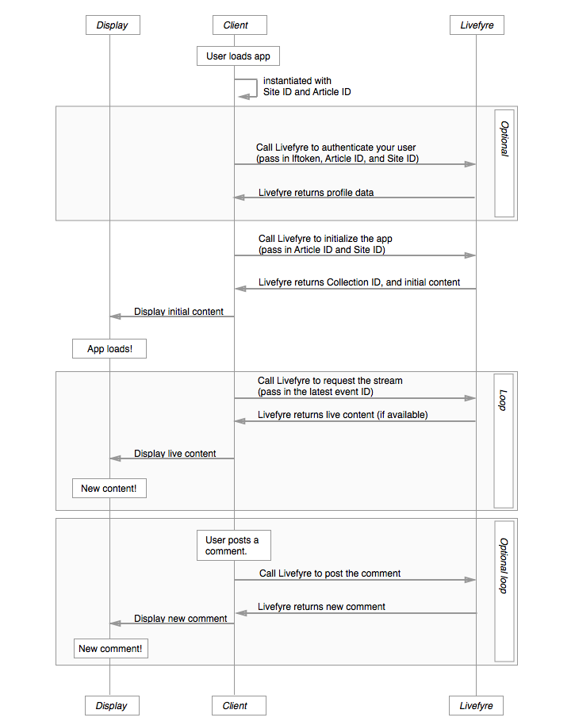

# Arquitectura{#architecture}

Conozca las convenciones de Livefyre y cómo organiza el contenido Livefyre.

Esta sección proporciona información general sobre la Arquitectura de red de Livefyre.

## Información general de redes y sitios

Livefyre organiza usuarios y contenido por red y sitio. Cada red puede tener una o más cuentas de usuario asociadas con ella, y cada red puede incluir uno o más sitios de Livefyre. Un sitio de Livefyre es una agrupación arbitraria de colecciones. Una colección se asigna a un ID de artículo en el CMS.

## Explicación de las redes {#section_hqt_4m4_xz}

Los clientes con varios dominios pueden compartir cuentas de usuario en todos los dominios mediante una sola red de Livefyre. Los clientes que deseen mantener cuentas de usuario independientes para distintos dominios necesitarán redes de Livefyre independientes.

La configuración se puede aplicar a sitios, redes y colecciones (lo que se conoce como conversación en la ilustración anterior).

>[!NOTE]
>
>Algunos ajustes solo están disponibles en el nivel de red (como preferencias de notificación por correo electrónico, correo electrónico de la dirección y logotipos personalizados de correo electrónico). Si desea que esta configuración sea diferente para cada dominio, debe utilizar varias redes.

## Explicación de los sitios {#section_vjw_nm4_xz}

Un sitio es una agrupación arbitraria de artículos. La agrupación resulta útil ya que permite asignar diferentes moderadores a diferentes grupos de contenido. Los moderadores y propietarios pueden configurarse para moderar el contenido y configurar la configuración de administración a nivel de red o de sitio. Si desea que algunos moderadores solo vean ciertas colecciones, estas colecciones pueden configurarse como un sitio de Livefyre independiente.

>[!NOTE]
>
>No hay límite en el número de sitios que puede tener en la red personalizada.

## Diagrama de secuencia de aplicaciones {#section_mw2_lm4_xz}

Tanto si desea implementar una función personalizada con los extremos proporcionados por Livefyre como si simplemente necesita depurar un problema, le ayudará a comprender cómo funciona el flujo de respuesta/solicitud de la aplicación Livefyre.

1. Cuando el cliente visite su sitio web, cree una instancia de la aplicación Livefyre con el ID del sitio y el ID del artículo.
1. Si desea autenticar al usuario (valioso para la evaluación del tráfico, así como para la protección del sitio), envíe a Livefyre la información del sitio y el token de perfil de usuario.
1. Envíe Livefyre el ID del sitio y el ID del artículo para inicializar la aplicación.

   Livefyre devuelve el contenido inicial.

   Envíe este contenido a la página y muestre la aplicación.

1. Para actualizar el contenido que se muestra en la página, envíe a Livefyre el ID de evento más reciente de la página. Si hay contenido nuevo disponible, se devolverá.

   Vuelva a cargar la página con nuevo contenido y repita el proceso indefinidamente.

1. Si permite que los usuarios publiquen contenido nuevo, desencadene un evento cuando se publique contenido nuevo en el sitio para publicarlo en Livefyre. Livefyre devolverá un flujo actualizado, que puede utilizar para actualizar el sitio.
