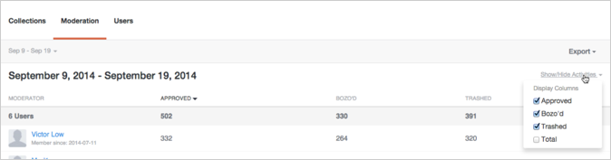

# Analytics  {#analytics}

Analizar la actividad de usuario, contenido y moderador del sitio.

## Analytics  {#topic_22D8FAE581CD440EA02B1595520F60C2}

Analizar la actividad de usuario, contenido y moderador del sitio.

Livefyre Analytics proporciona acceso a los datos de red en los tableros de conversaciones, moderación y usuario fáciles de leer. Utilice estos tableros para supervisar la actividad y ejecutar análisis rápidos en su sitio.

Los tableros pueden filtrarse por sitio, fecha y actividad. Utilice el desplegable Red en la parte superior izquierda de la ventana para seleccionar un sitio que mostrar. Una vez generado, haga clic en el encabezado de una columna para ordenar o sitúe el ratón sobre el gráfico para obtener información más específica sobre cualquier punto de datos.

Esta página describe:

* Selección de un [intervalo](https://answers.livefyre.com/livefyre-studio-version-1/studio/analytics/#DateRange) de fechas para el tablero
* [Mostrar/ocultar actividades disponibles](https://answers.livefyre.com/livefyre-studio-version-1/studio/analytics/#ShowHideActivities)
* [Exportación de datos de tablero](https://answers.livefyre.com/livefyre-studio-version-1/studio/analytics/#ExportDashboardData)
* [Panel de colecciones](https://answers.livefyre.com/livefyre-studio-version-1/studio/analytics/#CollectionsDashboard)
* [Panel de moderación](https://answers.livefyre.com/livefyre-studio-version-1/studio/analytics/#ModerationDashboard)
* [Panel de usuarios](https://answers.livefyre.com/livefyre-studio-version-1/studio/analytics/#UsersDashboard)

>[!NOTE]
>
>Actualmente, Analytics admite actividades procedentes de aplicaciones principales y moderación de Livefyre. La mayoría de las actividades incluidas en estos tableros también están disponibles a través [de eventos](https://answers.livefyre.com/developers/reference/app-customizations/javascript-events/)JavaScript de Livefyre, que pueden utilizarse para poder usar su propia herramienta de análisis personalizado o de terceros.

## Intervalo de fechas {#concept_798C438120E643B6BE262C9997DC87C4}

Haga clic en la fecha desplegable para seleccionar un intervalo que mostrar. Utilice las fechas rápidas o seleccione una fecha de inicio y de finalización de los calendarios proporcionados.

Fechas rápidas:

* **Hoy:** Muestra los datos de la medianoche del día actual, hasta la última hora completa antes de este momento.
* **Ayer:** Muestra los datos anteriores de 24 horas.
* **7 días:** Muestra los datos anteriores a 7 días, sin incluir hoy.
* **30 días:** Muestra los datos anteriores de 30 días, sin incluir hoy.
* **Esta semana:** Muestra los datos de la medianoche del último domingo, hasta la última hora completa antes de este momento.
* **Este mes:** Muestra los datos de la medianoche del primer día del mes actual, hasta la última hora completa antes de este momento.
* **Última semana:** Muestra los datos de la semana pasada.
* **Último mes:** Muestra los datos del mes pasado.

## Mostrar u ocultar actividades {#concept_022D9851CBCE4A2FB80D0AE52A23744D}

Las actividades son acciones que los usuarios realizan en el sitio, incluso comentarios, marcado, uso compartido y moderación. Use el menú desplegable **Mostrar/Ocultar actividades** para seleccionar actividades que desee incluir en el tablero.

>[!NOTE]
>
>Si selecciona nuevos eventos para el filtro, volverá a procesar la página sin cambiar la dirección URL.

Las actividades disponibles varían según el tipo de tablero y la exportación, y pueden incluir:

* **Anuncios:** Muestra los datos de la medianoche del día actual, hasta la última hora completa antes de este momento.
* **Respuestas:** Muestra los datos anteriores de 24 horas.
* **Cantidad de "Me gusta":** Muestra los datos anteriores a 7 días, sin incluir hoy.
* **No me gusta:** Muestra los datos anteriores de 30 días, sin incluir hoy.
* **Contiene medios:** Muestra los datos de la medianoche del último domingo, hasta la última hora completa antes de este momento.
* **La publicación tiene una carga de foto:** Muestra los datos de la medianoche del primer día del mes actual, hasta la última hora completa antes de este momento.
* **La publicación tiene un vínculo:** Muestra los datos de la semana pasada.
* **La publicación tiene @ mentions:** Muestra los datos del mes pasado.
* **Aprobado:** Muestra los datos del mes pasado.
* **Bozo'd:** Muestra los datos del mes pasado.
* **Vaciado:** Muestra los datos del mes pasado.
* **Total de moderación:** Muestra los datos del mes pasado.

## Exportación de datos de tablero {#concept_730DB61A9F894BE6BFB34E0E2A421ED3}

Utilice el menú desplegable **Exportar** para exportar los datos del tablero como archivo CSV.

* Compendio diario (solo colecciones): exporta el registro diario de la última semana completa para cada colección.
* Datos de tabla: exporta todos los datos resumidos de colecciones (todas las columnas y todas las filas del informe actual).
* Datos sin procesar: exporta todos los eventos individuales que se utilizaron para crear el informe resumido actual.

>[!NOTE]
>
>Estos informes pueden tardar unos minutos en exportarse. Todas las marcas de hora son temporales de Unix.

## Colecciones {#concept_228D8E5553784DB8BABF3819A5FF0345}

El panel Colecciones enumera la actividad de los usuarios por colección, lo que le permite determinar el contenido que más le interese (y menos). Cada colección incluida incluye un vínculo a la página en la que se encuentra.

## Moderación {#concept_98689B1E804B43CEA21E3F456107CCD9}

El panel Moderación enumera los eventos por moderador, permitiéndole evaluar su actividad. Utilice este informe para encontrar los Moderadores más activos y las acciones de moderación más comunes.

>[!NOTE]
>
>Las actividades de moderación automatizada de Livefyre se enumerarán para el nombre del moderador Livefyre System.

## Usuarios {#concept_D1A83E31C7B5467F9C844CBF9A740E12}

El panel Usuarios muestra la actividad del sitio por usuario, permitiéndole analizar cómo interactúan los usuarios individuales con el sitio. Utilice este tablero para encontrar a los usuarios más activos de su sitio y evaluar las actividades del sitio más populares.

