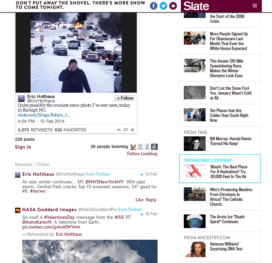

# Blog en vivo{#live-blog}

Live Blog permite a sus escritores y editores publicar actualizaciones en tiempo real, transformando su sitio en una atractiva fuente de noticias en vivo.

Las publicaciones de su equipo, enriquecidas con imágenes, vídeo, audio y contenido incrustado, se convierten en la fuente de nuevas conversaciones e hilos. Live Blog es perfecto cuando se implementa para revelaciones de productos, programas de premios y eventos deportivos.

Live Blog es diferente de Comentarios de las siguientes maneras:

* Solo los propietarios y los moderadores pueden ver el cuadro de comentarios y crear publicaciones de nivel superior.
* Las respuestas de los usuarios pueden desactivarse para crear una experiencia de solo blogueros.
* Los usuarios pueden escribir, cargar fotos o publicar vínculos incrustables desde su ordenador o dispositivo móvil.
* La fuente de comentarios es más grande y los avatares son más pequeños para resaltar el contenido.
* Los avatares pueden deshabilitarse, si lo desea.

Con la llegada de otra tormenta de nieve, Slate quería proporcionar a los lectores actualizaciones instantáneas sobre los salvajes cambios climáticos en la costa este. Con un blog en vivo, los editores de Slate pudieron compartir instantáneamente actualizaciones sobre la tormenta, incluyendo sus propias fotos, tuits de usuarios e información sobre la nevada. El Live Blog fue tan útil que llegó a la primera página del sitio de Slate.

