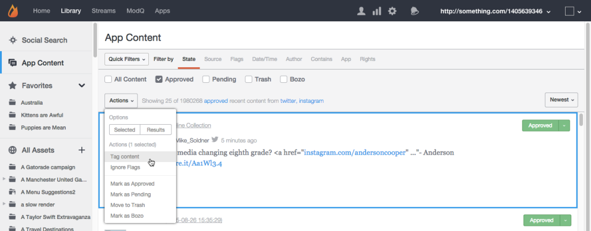
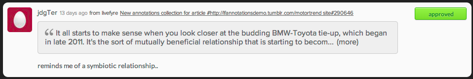

# Moderar contenido mediante el contenido de la aplicación{#moderate-content-using-app-content}

La ficha Contenido de la aplicación de la biblioteca le permite moderar el contenido publicado en las aplicaciones.

## Moderar contenido {#section_md5_sqm_zz}

Utilice el panel Contenido de la aplicación para moderar el contenido de la lista, cambiando su estado, el estado de su autor o agregando una nota. Para moderar el contenido, pase el ratón sobre el contenido de la lista para cambiar los marcadores disponibles o utilice el **[!UICONTROL pulldown]** menú para cambiar el estado del contenido seleccionado individual o múltiple.

En el contenido de la aplicación puede:

* **[!UICONTROL Tag Content]**. Seleccione **[!UICONTROL Tag Content]** para agregar etiquetas a partes individuales o múltiples de contenido simultáneamente.

* **[!UICONTROL Ignore Flags]**. Seleccione **[!UICONTROL Ignore Flags]** para excluir el contenido seleccionado de los resultados del filtro de búsqueda marcado. La selección **[!UICONTROL Ignore Flags]** de un elemento no cambia su estado; simplemente lo elimina de los resultados de búsqueda para este filtro de búsqueda en adelante, para todos los usuarios de Studio.

* **[!UICONTROL Change Content Status]**. Haga clic en un fragmento de contenido y, a continuación, utilice el **[!UICONTROL Actions]** menú para cambiar su estado. (Utilice la tecla Comando o Control para seleccionar varios elementos y, a continuación, utilice el menú para cambiar el estado de varios fragmentos de contenido simultáneamente).

   Las opciones varían según el estado actual del contenido de la lista.

   | Estado actual | Puede cambiarse a |
   |---|---|
   | Aprobado | Pendiente, Papelera, Bozo |
   | Bozo | Aprobado, Pendiente, Papelera |
   | Papelera | Aprobado, Pendiente, Bozo, Eliminar |
   | Pendiente | Aprobado, Papelera, Bozo |

* **[!UICONTROL Save as Assets]**. Seleccione **[!UICONTROL Save as Assets]** para abrir el cuadro de diálogo Opciones avanzadas, desde el que puede guardar los elementos seleccionados en la biblioteca de recursos, publicarlos en una aplicación o solicitar derechos de reutilización a su autor.

* Moderar según las recomendaciones. Utilice el **[!UICONTROL Moderation Recommendation Indicator]** contenido de la aplicación para filtrar el contenido que la recomendación de moderación identifica como probable que se elimine.

   En Contenido de la aplicación, las recomendaciones de moderación tienen este aspecto:  

## Moderar contenido de notas {#section_i2s_nqm_zz}

El trabajo con Sidenotes en el panel Contenido difiere del trabajo con otros tipos de contenido de varias formas:

* Las fichas Más información, Respuestas, Marcas e informes y Agregar una nota no están disponibles.
* No se puede etiquetar el contenido de Sidenotes ni marcarlo como destacado.

También difiere en que muestra no sólo el contenido que se debe moderar; también muestra el texto seleccionado cuando se agregó Sidenote, lo que le permite evaluar el contenido en contexto.

Haga clic en el cuadro de texto para ampliarlo e incluir la cotización seleccionada por el usuario.

La moderación de contenido de Sidenotes permite cambios masivos y cambios de estado individuales, como se describe más arriba.

## Moderar usuarios de Livefyre {#section_grw_mqm_zz}

Pase el ratón sobre el nombre de usuario de Livefyre para abrir un menú desplegable que le permita **[!UICONTROL Ban the User]**, obtener **[!UICONTROL More Info]** o ver una lista de sus **[!UICONTROL Comments]**. Al hacer clic en este menú se abrirá la tarjeta de información del usuario en la página de Studio **[!UICONTROL Users]** .

Para obtener más información sobre cómo moderar usuarios en la **[!UICONTROL Users]** página, consulte [Moderar menú de usuarios](/help/using/c-features-livefyre/c-about-moderation/t-moderate-users-modq.md#t_moderate_users_modq).
