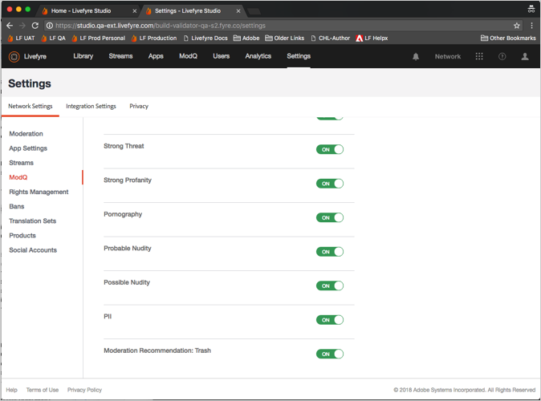

# Configuración de moderación{#setting-up-moderation}

Utilice la ficha Moderación para definir reglas de premoderación para el contenido entrante, incluidas listas de profanidad, reglas de indicador y direcciones IP prohibidas.

## Funcionamiento de moderación {#section_kyf_gvc_t1b}

Puede moderar contenido de las siguientes maneras:

* Premodere automáticamente el contenido para filtrar el contenido no deseado según las reglas que configure antes de publicar el contenido.
* Elimine o apruebe manualmente el contenido marcado con la premoderación automática mediante el uso de modq o el contenido de la aplicación en la biblioteca.
* Identifique a los visitantes del sitio que publican repetidamente contenido ofensivo para evitar que se anuncien mediante la prohibición de usuarios específicos de Livefyre, usuarios sociales o direcciones IP.
* Identificar a las personas y al contenido que siempre pueden mostrar usuarios o desactivar filtros para flujos, sitios o redes específicos.

Puede premoderar automáticamente el contenido de las siguientes maneras:

* Configure reglas para marcar automáticamente ciertos tipos de contenido:

   * Configure las reglas de indicador para el contenido marcado por el indicador de visitantes del sitio usando **[!UICONTROL Settings > Moderation > Rules]**
   * Configure reglas SEGURAS mediante **[!UICONTROL Settings > Moderation > Rules]**
   * Prohibir usuarios específicos de Twitter usando **[!UICONTROL Settings > Streams]**
   * Prohibir direcciones IP mediante **[!UICONTROL Settings > Bans]**
   * Prohibir las regiones IP por código de país por solicitud. El contenido prohibido se marca como Correo no deseado.

* Cree una lista de palabras que considere profanidad en la Lista de profanidad debajo **[!UICONTROL Settings > Moderation > Rules]** de su red o sitio.
* Los usuarios de la lista blanca (siempre permiten que se muestre contenido de estos usuarios) mediante o desactivando filtros para flujos, sitios o redes específicos.

Una vez configuradas las listas de profanidad, los filtros SAFE y las reglas, puede elegir entre moderar el contenido y aplicar los filtros seguros en flujos. Para obtener más información, consulte [Opciones de regla de flujo para todas las reglas de flujo](/help/using/c-streams/c-stream-rule-options-for-all-stream-rules.md#c_stream_rule_options_for_all_stream_rules).

Livefyre marca el contenido como **[!UICONTROL Approved]****[!UICONTROL Pending]****[!UICONTROL Junk]**, etc. según la procedencia del contenido, dónde se publicará y las reglas configuradas en el sistema. En la tabla siguiente se describen las acciones que Livefyre toma, en función de estos factores, en detalle.

## Funcionamiento de moderación

| Contenido proveniente de: | Envío de contenido a: | Estado de aprobación |
|--- |--- |--- |
| Biblioteca | Aplicación | Contenido aprobado |
| Búsqueda social | Aplicación | Contenido aprobado |
| Regla de flujo | Aplicación | ¿El contenido marcado como No deseado por filtro SEGURO?  <ul><li>No - Flujo de moderación de flujo a aplicación</li><li>Sí - Contenido extraído</li></ul> |
| Biblioteca | Carpeta | Sin estado (en carpeta, no publicado, sin borrar) |
| Búsqueda social | Carpeta | Sin estado (en carpeta, no publicado, sin borrar) |
| Regla de flujo | Carpeta | ¿El contenido marcado como No deseado por filtro SEGURO?  <ul><li>No: Sin estado (en carpeta, no publicado, sin borrar)</li><li>Sí - Contenido extraído</li></ul> |
| Publicación de la aplicación | Aplicación | ¿El contenido marcado como No deseado por filtro SEGURO?  <ul><li>No: flujo de moderación de moderación posterior a la aplicación</li><li>Sí - Contenido extraído</li></ul> |

## Flujo de trabajo de moderación de flujo a aplicación {#section_z5z_w4d_t1b}

Antes de publicar el contenido de un flujo en una aplicación, Livefyre realiza las siguientes comprobaciones para determinar qué hacer con el contenido:

1. Si SAFE marca el contenido como vacío o de soltar, Livefyre borrará el contenido.
1. Si SAFE no marca el contenido como vacío, Livefyre comprueba si está activada la premoderación.
1. Si la moderación está activada, Livefyre marca el contenido como pendiente.
1. Si configura reglas modq, Livefyre envía el contenido a modq.
1. Si la moderación no está activada, Livefyre comprueba si SAFE marcó el contenido.
1. Si SAFE marcó el contenido, Livefyre aprueba el contenido y publica el contenido en la aplicación.
1. Si SAFE marca el contenido y no ha configurado las reglas SAFE, Livefyre aprueba el contenido y publica el contenido en la aplicación.
1. Si SAFE marca el contenido y usted establece reglas SAFE, Livefyre comprueba si se configuran las reglas SAFE para el flujo.
1. Si configura reglas SAFE para el flujo, Livefyre aprueba el contenido y publica el contenido en la aplicación. Si no ha configurado las reglas SAFE para el flujo, Livefyre usa las reglas de moderación SAFE para determinar cómo gestionar el contenido (enviar a modq, papelera, etc.).

## Flujo de trabajo de moderación de la aplicación {#section_fwn_w4d_t1b}

Antes de publicar el contenido de una aplicación de aplicación en una aplicación, Livefyre realiza las siguientes comprobaciones para determinar qué hacer con el contenido:

1. Si el filtro SAFE marca el contenido como drop, Livefyre suelta el contenido.
1. Si SAFE no marca el contenido como drop, Livefyre comprueba si está activada la premoderación. Si la moderación está activada, Livefyre marca el contenido como pendiente. Si configura reglas modq, Livefyre envía el contenido a modq como pendiente. De lo contrario, el contenido permanece en estado pendiente en el contenido de la aplicación en la biblioteca.
1. Si la moderación no está activada, Livefyre comprueba si SAFE marcó el contenido. De lo contrario, Livefyre aprueba el contenido y publica el contenido en la aplicación.
1. Si SAFE marca el contenido y usted establece reglas SAFE, Livefyre utiliza la regla SAFE para determinar cómo gestionar el contenido (enviar a modq, papelera, etc.). Si SAFE marca el contenido y no ha configurado las reglas SAFE, Livefyre aprueba el contenido y publica el contenido en la aplicación.

## Filtros masivos {#section_lyk_ktx_vy}

El filtro masivo busca contenido repetitivo publicado en todas las redes de Livefyre en un lapso de tiempo corto. Si se detecta, este contenido se marca como Bulk y, a continuación, se desordena de forma predeterminada. Mientras que el contenido masivo puede ser generado por el usuario (como «Touchdown»)»» publicado repetidamente en una conversación durante un juego de fútbol popular), la mayoría se origina en campañas no deseadas. Este filtro es independiente del idioma y funciona con cualquier idioma. Para personalizar el filtro masivo, debe ponerse en contacto con la asistencia de Livefyre.

## Reglas {#section_gqz_ksk_f1b}

Utilice la sección Reglas para crear reglas de premoderación basadas en indicadores seguros y de usuario aplicados. Este panel ofrece dos tipos de reglas:

* **[!UICONTROL Flag Rules:]** especifique una acción que debe realizarse en un comentario marcado por los usuarios un número definido de veces.
* ****[!UICONTROL SAFE Rules:]combine indicadores SAFE con acciones que realizar en el contenido marcado.

Para crear reglas de indicador, seleccione el indicador (Ofensiva, Tema desactivado, Rechazar o Correo no deseado), introduzca la cantidad de veces que debe aplicarse a un fragmento de contenido y seleccione la acción que realizar. Puede establecer una regla de marca para cada opción de indicador (Ofensiva, Tema desactivado, Rechazar o Correo no deseado).

Puede crear reglas en los niveles Red, Sitio y Flujo. Las reglas de nivel de sitio heredan las reglas de red, a menos que configure las reglas del sitio de forma diferente. Las reglas de flujo heredan las reglas del sitio a menos que las configura de forma diferente.

Acciones disponibles:

* ****[!UICONTROL Trash it:]envía el comentario marcado a la papelera.
* **[!UICONTROL Bozo it:]** oculta el comentario marcado de todos los usuarios, excepto su redactor, a los que permanece visible.
* **[!UICONTROL Pending:]** establece el contenido como pendiente. Si establece Premoderación en Activado, **[!UICONTROL Settings > ModQ]**entonces estará en modq. De lo contrario, solo estará en Contenido de la aplicación.

>[!NOTE]
>
>Livefyre recomienda crear reglas para comentarios Bozo marcado como Correo no deseado o Ofensiva por cinco usuarios.

## Recomendaciones de moderación {#section_ec3_vr3_2cb}

Puede utilizar recomendaciones de moderación para determinar cómo moderar el contenido publicado por los visitantes del sitio en aplicaciones de Livefyre. El indicador de recomendación de moderación recomienda cuando es posible que un fragmento de contenido se descargue en función de las acciones realizadas anteriormente en contenido similar. Para utilizar Recomendaciones de moderación:

1. Active la funcionalidad de Recomendaciones de moderación poniéndose en contacto con su profesional de asistencia técnica de Adobe Livefyre.
1. Configure las recomendaciones de moderación en Configuración de red.

   Configure las recomendaciones de moderación utilizando **[!UICONTROL Livefyre Recommends Trash]** la configuración de **[!UICONTROL Network Settings]**.

   

1. Configure una regla SAFE para indicar a Livefyre qué hacer con el contenido que la recomendación de moderación identifica como contenido que probablemente se eliminará. Para obtener más información sobre cómo configurar una regla SAFE para la **[!UICONTROL Livefyre Recommends Trash]** opción, consulte [Moderación](/help/using/c-features-livefyre/c-about-moderation/c-moderation.md#c_moderation).

   

1. Use el **[!UICONTROL Moderation Recommendation Indicator]** contenido en modq o en Contenido de la aplicación para filtrar el contenido que la recomendación de moderación identifica probablemente que se eliminará.

   En modq, el indicador tiene este aspecto: 

   Para obtener más información sobre cómo utilizar Recomendaciones de moderación para moderar contenido en modq, consulte [modq](/help/using/c-features-livefyre/c-about-moderation/c-modq.md#c_modq).

   En el contenido de la aplicación, las recomendaciones de moderación tienen este aspecto: 

   Para obtener más información sobre cómo utilizar Recomendaciones de moderación en Contenido de aplicación, consulte [Moderar contenido con contenido de aplicación](/help/using/c-features-livefyre/c-about-moderation/c-moderate-content-using-app-content.md#c_moderate_content_using_app_content).
