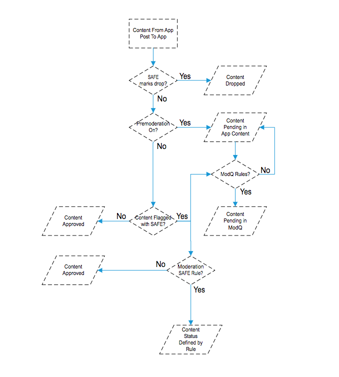
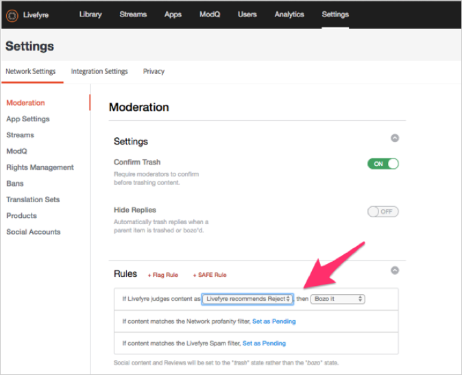

# Configuración de moderación{#setting-up-moderation}

Utilice la pestaña Moderación para establecer reglas de premoderación para el contenido entrante, incluidas listas de profanidad, reglas de marca y direcciones IP prohibidas.

## Cómo funciona la moderación {#section_kyf_gvc_t1b}

Puede moderar el contenido de las siguientes maneras:

* Premoderar contenido automáticamente para filtrar el contenido no deseado en función de las reglas que haya configurado antes de publicar el contenido.
* Elimine o apruebe manualmente el contenido marcado con la moderación previa automática mediante ModQ o el Contenido de la aplicación en la biblioteca.
* Identifique a los visitantes del sitio que anuncian contenido ofensivo repetidamente para evitar que anuncien prohibiendo usuarios específicos de Livefyre, usuarios sociales o direcciones IP.
* Identifique a las personas y el contenido que siempre se pueden mostrar incluyendo en la lista de usuarios permitidos o desactivando los filtros para flujos, sitios o redes específicos.

El contenido se puede premoderar automáticamente de las siguientes maneras:

* Configure reglas para marcar automáticamente ciertos tipos de contenido:

   * Configure las reglas de marca para el contenido que está marcado por el indicador de visitantes del sitio utilizando **[!UICONTROL Settings > Moderation > Rules]**
   * Configure reglas SAFE usando **[!UICONTROL Settings > Moderation > Rules]**
   * Prohibir usuarios específicos de Twitter usando **[!UICONTROL Settings > Streams]**
   * Prohibir direcciones IP usando **[!UICONTROL Settings > Bans]**
   * Prohibir regiones IP por código de país por solicitud. El contenido prohibido se marcará como SPAM.

* Cree una lista de palabras que considere profanas en la Lista de profecías en **[!UICONTROL Settings > Moderation > Rules]** para su Red o Sitio.
* Permitir la visualización del contenido de estos usuarios (siempre permitir que se muestre) mediante el uso o la desactivación de filtros para flujos, sitios o redes específicos.

Después de configurar las listas de blasfemia, los filtros SAFE y las reglas, puede elegir si premoderar el contenido y aplicar los filtros SAFE en los flujos. Para obtener más información, consulte [Opciones de regla de flujo para todas las reglas de flujo](/help/using/c-streams/c-stream-rule-options-for-all-stream-rules.md#c_stream_rule_options_for_all_stream_rules).

Livefyre marca el contenido como **[!UICONTROL Approved]**, **[!UICONTROL Pending]**, **[!UICONTROL Junk]**, etc. en función de la procedencia del contenido, de dónde se publicará y de las reglas que haya configurado en el sistema. En la tabla siguiente se describen detalladamente las acciones que realiza Livefyre, según estos factores.

## Cómo funciona la moderación

| El Contenido Procede De: | Envío de contenido a: | Estado de aprobación |
|--- |--- |--- |
| Biblioteca | Aplicación | Contenido aprobado |
| Búsqueda social | Aplicación | Contenido aprobado |
| Regla de flujo | Aplicación | ¿El contenido está marcado como basura por el filtro SAFE?  <ul><li>No: flujo de trabajo de moderación de flujo a aplicación</li><li>Sí: Contenido enviado a la papelera</li></ul> |
| Biblioteca | Carpeta | Sin estado (en la carpeta, no publicado, no enviado a la papelera) |
| Búsqueda social | Carpeta | Sin estado (en la carpeta, no publicado, no enviado a la papelera) |
| Regla de flujo | Carpeta | ¿El contenido está marcado como basura por el filtro SAFE?  <ul><li>No: sin estado (en la carpeta, no publicado, no enviado a la papelera)</li><li>Sí: Contenido enviado a la papelera</li></ul> |
| Publicación de aplicación | Aplicación | ¿El contenido está marcado como basura por el filtro SAFE?  <ul><li>No: flujo de trabajo de moderación posterior a la aplicación</li><li>Sí: Contenido enviado a la papelera</li></ul> |

## Flujo de trabajo de moderación de flujo a aplicación {#section_z5z_w4d_t1b}

Antes de que el contenido de un flujo se publique en una aplicación, Livefyre realiza las siguientes comprobaciones para determinar qué hacer con el contenido:

1. Si SAFE marca el contenido como basura o caída, Livefyre lo destruye.
1. Si SAFE no marca el contenido como basura, Livefyre comprueba si la premoderación está activada.
1. Si la premoderación está activada, Livefyre marca el contenido como pendiente.
1. Si configura reglas de ModQ, Livefyre envía el contenido a ModQ.
1. Si la premoderación no está activada, Livefyre comprueba si SAFE ha marcado el contenido.
1. Si SAFE marcó el contenido, Livefyre aprueba el contenido y publica el contenido en la aplicación.
1. Si SAFE marca el contenido y no configuró reglas SAFE, entonces Livefyre aprueba el contenido y publica el contenido en la aplicación.
1. Si SAFE marca el contenido y configura reglas SAFE, Livefyre comprueba si ha configurado reglas SAFE para el flujo.
1. Si configura reglas SEGURAS para el flujo, Livefyre aprueba el contenido y lo publica en la aplicación. Si no configuró las reglas SAFE para el flujo, Livefyre usa las reglas SAFE de moderación para determinar cómo manejar el contenido (enviar a ModQ, basura, etc.).

## Flujo de trabajo de moderación posterior a la aplicación {#section_fwn_w4d_t1b}

Antes de que el contenido de una publicación de la aplicación se publique en una aplicación, Livefyre realiza las siguientes comprobaciones para determinar qué hacer con el contenido:

1. Si el filtro SAFE marca el contenido como desplegable, Livefyre descarta el contenido.
1. Si SAFE no marca el contenido como desplegable, Livefyre comprueba si la premoderación está activada. Si la premoderación está activada, Livefyre marca el contenido como pendiente. Si configura reglas de ModQ, Livefyre envía el contenido a ModQ como pendiente. Si no es así, el contenido permanece en estado pendiente en Contenido de la aplicación, en la biblioteca.
1. Si la premoderación no está activada, Livefyre comprueba si SAFE ha marcado el contenido. Si no es así, Livefyre aprueba el contenido y lo publica en la aplicación.
1. Si SAFE marca el contenido y configura reglas SAFE, Livefyre utiliza la regla SAFE para determinar cómo manejar el contenido (enviar a ModQ, basura, etc.). Si SAFE marca el contenido y no configuró reglas SAFE, entonces Livefyre aprueba el contenido y publica el contenido en la aplicación.

## Filtros masivos {#section_lyk_ktx_vy}

El filtro masivo busca contenido repetitivo publicado en todas las redes de Livefyre en un breve periodo de tiempo. Si se detecta, este contenido se marca como Masivo y, a continuación, se desecha de forma predeterminada. Mientras que el contenido masivo puede generarse por el usuario (como &quot;Touchdown!&quot; publicado repetidamente en un Chat durante un popular juego de fútbol), la mayoría se origina en campañas de spam. Este filtro es independiente del idioma y funciona con cualquier idioma. Para personalizar el filtro masivo, debe ponerse en contacto con el soporte técnico de Livefyre.

## Reglas {#section_gqz_ksk_f1b}

Utilice la sección Reglas para crear reglas de premoderación basadas en indicadores SAFE y aplicados por el usuario. Este panel ofrece dos tipos de reglas:

* **[!UICONTROL Flag Rules:]** especifique una acción que se debe realizar en un comentario marcado por los usuarios un número definido de veces.
* **[!UICONTROL SAFE Rules:]**combinar indicadores SAFE con acciones que realizar en el contenido marcado.

Para crear reglas de marca, seleccione el indicador (Ofensivo, Desactivado, No conforme o Correo no deseado), introduzca el número de veces que debe aplicarse a un fragmento de contenido y seleccione la acción que desea realizar. Puede establecer una regla de marca para cada opción de indicador (Ofensivo, Desactivado, No conforme o Correo no deseado).

Puede crear reglas en los niveles de red, sitio y flujo. Las reglas de nivel de sitio heredan reglas de red, a menos que las reglas del sitio se configuren de forma diferente. Las reglas de flujo heredan las reglas del sitio a menos que las configure de forma diferente.

Acciones disponibles:

* **[!UICONTROL Trash it:]**envía el comentario marcado a la papelera.
* **[!UICONTROL Bozo it:]** oculta el comentario marcado de todos los usuarios, excepto de su escritor, a los que sigue visible.
* **[!UICONTROL Pending:]** establece el contenido como pendiente. Si establece Premoderación en ON en **[!UICONTROL Settings > ModQ]**, entonces estará en ModQ. De lo contrario, solo estará en el Contenido de la aplicación.

>[!NOTE]
>
>Livefyre recomienda crear reglas para los comentarios de Bozo marcados como correo no deseado u ofensivo por cinco usuarios.

## Recommendations de moderación {#section_ec3_vr3_2cb}

Puede utilizar las recomendaciones de moderación para ayudarle a determinar cómo moderar el contenido publicado por los visitantes del sitio en las aplicaciones de Livefyre. El indicador de recomendación de moderación recomienda cuándo es probable que un fragmento de contenido sea enviado a la papelera, en función de las acciones que haya realizado anteriormente en contenido similar. Para usar Moderation Recommendations:

1. Active la funcionalidad Moderación de Recommendations poniéndose en contacto con su profesional de soporte de Adobe Livefyre.
1. Configure las recomendaciones de moderación en Configuración de red.

   Configure las recomendaciones de moderación usando la configuración **[!UICONTROL Livefyre Recommends Trash]** en **[!UICONTROL Network Settings]**.

   

1. Configure una regla SAFE para indicar a Livefyre qué hacer con el contenido que la recomendación de moderación identifica como contenido que es probable que sea enviado a la papelera. Para obtener más información sobre cómo configurar una regla SAFE para la opción **[!UICONTROL Livefyre Recommends Trash]**, consulte [Moderación](/help/using/c-features-livefyre/c-about-moderation/c-moderation.md#c_moderation).

   

1. Use **[!UICONTROL Moderation Recommendation Indicator]** en ModQ o en Contenido de la aplicación para filtrar el contenido que la recomendación de moderación identifique como susceptible de ser enviado a la papelera.

   En ModQ, el indicador tiene este aspecto:  

   Para obtener más información sobre cómo usar Moderation Recommendations para moderar contenido en ModQ, consulte [ModQ](/help/using/c-features-livefyre/c-about-moderation/c-modq.md#c_modq).

   En Contenido de aplicación, las recomendaciones de moderación tienen este aspecto:  

   Para obtener más información sobre cómo usar Moderación de Recommendations en el contenido de la aplicación, consulte [Moderar contenido usando contenido de la aplicación](/help/using/c-features-livefyre/c-about-moderation/c-moderate-content-using-app-content.md#c_moderate_content_using_app_content).
