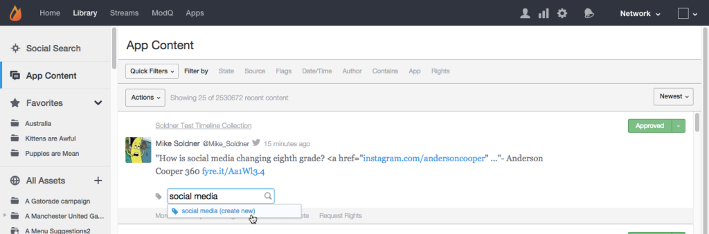

# Ficha Contenido de la aplicación{#app-content-tab}

Administración de contenido en la red de Livefyre.

La ficha Contenido de la aplicación de su biblioteca le permite buscar y moderar contenido publicado en sus aplicaciones. La **[!UICONTROL App Content]** ficha permite varios filtros de búsqueda con búsqueda comodín, para permitirle definir de forma más rápida y sencilla los parámetros de búsqueda.

Utilice la ficha Contenido de la aplicación para:

* Buscar contenido
* Ver historial de contenido
* Moderar contenido
* Agregar una etiqueta
* Contenido de la función
* Asociación de contenido con productos del catálogo de productos

Para obtener más información sobre cómo moderar contenido mediante la ficha Contenido de la aplicación, consulte .

## Búsqueda comodín {#section_jvr_ntm_zz}

Los campos de búsqueda de Livefyre admiten comodines, que permiten agregar un asterisco (*) a palabras (o fragmentos de palabras) para capturar coincidencias parciales.

Por ejemplo:

* pelota devuelve pelota solamente
* ball * devuelve pelota y globo
* * ball devuelve pelota y fútbol
* * ball * devuelve pelota y uniball y nieve

## Buscar contenido {#section_fw1_mtm_zz}

El panel Contenido de la aplicación permite limitar la búsqueda utilizando diferentes opciones de filtrado de contenido.

Utilice el **[!UICONTROL Quick Filters]** menú desplegable para reducir el contenido devuelto a **[!UICONTROL All Content]****[!UICONTROL All Sidenotes]****[!UICONTROL Approved]**, **[!UICONTROL Approved & Flagged]****[!UICONTROL Pending]** o **[!UICONTROL Rights Requests]** el estado. A continuación, seleccione una **[!UICONTROL Filter by]** opción y utilice las casillas de verificación o los campos de entrada disponibles para limitar la búsqueda.

Utilice el menú desplegable para ordenar el contenido en la lista, **[!UICONTROL Newest]****[!UICONTROL Oldest]****[!UICONTROL Recently updated]****[!UICONTROL Most flags]** o **[!UICONTROL Most liked]** en.

## Filtrar por opciones {#section_aqn_xqm_zz}

Utilice **[!UICONTROL Filter by]** la barra para filtrar por las siguientes opciones:

* **Estado** Permite filtrar por el estado de moderación actual del contenido: ** [!UICONTROL All Content]** **[!UICONTROL Approved]**, **[!UICONTROL Pending]** o **[!UICONTROL Bozo]**.

* **Fuente** Permite filtrar por origen del contenido. Seleccione **[!UICONTROL Livefyre]** para enumerar el contenido generado por el usuario publicado directamente en el flujo. Seleccione **[!UICONTROL Facebook]**, **[!UICONTROL Twitter]** o **[!UICONTROL RSS]** para incluir contenido extraído en las aplicaciones de esas fuentes.

* **Los indicadores** de selección de indicadores le permiten filtrar por **[!UICONTROL User Flags]** (correo no deseado, tema desactivado, ofensivo o rechazar), **[!UICONTROL System Flags]** aplicado por SAFE (Profanity, correo no deseado o mágico), o **[!UICONTROL Moderation Recommendations]** por. 

* **Fecha y hora** Le permite utilizar el fiter cuando el contenido era originalmente **[!UICONTROL Created]** (o extraído en la aplicación a través de socialsync o un flujo) o último **[!UICONTROL Modified]** (editado, marcado o modificado).

* **Autor** Permite filtrar por **[!UICONTROL IP]** la dirección del autor ( **[!UICONTROL Display Name]** se encuentra en el panel Usuarios o desde encima del contenido publicado por el autor) o **[!UICONTROL User ID]**(se encuentra en el panel Usuarios).

* **Contiene** Le permite filtrar los 90 días de contenido más recientes **[!UICONTROL Keyword]** por o **[!UICONTROL Content Tag]**. Seleccione **[!UICONTROL Media]** la casilla de verificación para devolver solo contenido que contenga medios. (Para buscar todo el contenido, desplácese hacia abajo por todo el contenido de la lista y haga clic **[!UICONTROL Search full data]** en).

   **Nota:** No se admite la búsqueda de varias etiquetas de contenido y palabra clave. Si se ingresan varias palabras clave o etiquetas, se utilizará la última palabra para la búsqueda.

   Al buscar por Etiqueta de contenido, las etiquetas sugeridas se rellenarán automáticamente al escribir en el campo de búsqueda. Los resultados de búsqueda devolverán todo el contenido que nunca se haya asignado a la etiqueta. (Utilice este campo para buscar el contenido destacado o haga clic **[!UICONTROL Featured]** en la etiqueta de cualquier contenido destacado en Studio).

   **Nota:** Utilice un signo menos (-) delante de un nombre de etiqueta para buscar contenido que no incluya esa etiqueta. Por ejemplo: Busque &#39;-Miley&#39;para buscar todo el contenido que no incluya la etiqueta&#39;Miley &#39;.

* **Aplicación** Permite filtrar por **[!UICONTROL Collection ID]**, **[!UICONTROL App Tag]** o ID **principal**. Al filtrar por ID principal, se devuelve todo el contenido que es una respuesta al ID de contenido de entrada. (Filtre por varias etiquetas introduciendo etiquetas separadas por coma).

* **Derechos** Permite filtrar por estado de solicitudes de derechos: ** [!UICONTROL Requested]** **[!UICONTROL Granted]**, **[!UICONTROL Replied]** o **[!UICONTROL Expired]**.

## Contenido de Bozo {#section_afl_vqm_zz}

En Aplicaciones, **[!UICONTROL Bozo]** el contenido solo se muestra al autor del contenido. Esto permite al usuario creer que su contenido ha sido aprobado, al mismo tiempo que lo oculta de todos los demás usuarios y moderadores.

>[!NOTE]
>
>El contenido social que se origina con socialsync o Streams **[!UICONTROL cannot]** se establece en Bozo.

Puede utilizar contenido bozo por las siguientes razones:

* El contenido identificado como correo no deseado por SAFE se establece automáticamente en el estado Bozo.
* Todo el contenido de los usuarios prohibidos se configura automáticamente en Bozo.
* El contenido se puede marcar Bozo desde Studio.
* Los moderadores pueden tener contenido Bozo directamente en el flujo.

## Ver historial de contenido {#section_ayz_tqm_zz}

El panel de contenido permite revisar el historial de todo el contenido enumerado, incluida la moderación, el filtro de correo no deseado, la fecha de publicación y cualquier indicador o notas de usuario asignados al elemento.

Utilice las fichas de la parte inferior del panel de contenido para ver su historial.

* **[!UICONTROL More Info:]** enumera toda la actividad de este contenido, incluido el envío, la edición, la comprobación de correo no deseado, el cambio de estado y las notas. La ID del contenido de Livefyre y la dirección IP del usuario también se muestran en esta sección.
* **[!UICONTROL Replies:]** indica un máximo de 6 respuestas. Haga clic para **[!UICONTROL Show all replies]** mostrar todas las respuestas al anuncio.

* **[!UICONTROL Flags & Reports:]** enumera todos los indicadores de usuario, con el avatar del usuario que marcó el contenido y cualquier informe (notas agregadas por el usuario al marcar el contenido).
* **[!UICONTROL Add a note:]** permite agregar una nota, visible para otros administradores o moderadores.
* **[!UICONTROL Request Rights:]** abre **[!UICONTROL New Rights Request]** el cuadro de diálogo, desde el cual se puede emitir una solicitud de derechos.

* ****[!UICONTROL Save as Asset:]abre **[!UICONTROL Advanced Options]** el cuadro de diálogo, que le permite guardar el elemento seleccionado en la biblioteca de recursos, publicarlo en una aplicación o solicitar derechos de reutilización de su autor.

## Agregar una etiqueta al contenido {#section_xb4_mxr_rdb}

Etiquetar contenido le permite categorizar y organizar el contenido para facilitar la personalización y personalización de estilos, o marcar el contenido como destacado.

Para agregar etiquetas, haga clic en el icono de signo más ( **[!UICONTROL +]**) debajo del contenido. Introduzca una nueva etiqueta o seleccione una de las etiquetas existentes.

## Búsqueda de imágenes en todos los recursos {#section_zxf_hsf_wcb}

Una vez que haya agregado el contenido a la biblioteca, puede buscar contenido por etiquetas inteligentes.

En la biblioteca, en Todos los recursos, puede buscar las imágenes existentes haciendo clic **[!UICONTROL Show Filters]** en y después:

* Introducción de texto para buscar en el campo de búsqueda
* Ordenar por relevancia
* Introducción de texto en **[!UICONTROL Tags]** el campo para buscar por etiquetas inteligentes. El algoritmo de clasificación Etiquetas inteligentes filtra el contenido utilizando una puntuación de confianza de etiqueta inteligente, la nueva posición del contenido y cuántas estrellas ha proporcionado el usuario.

## Contenido destacado {#section_emb_kqm_zz}

Seleccione **[!UICONTROL Featured]** la etiqueta predeterminada para marcar el contenido como destacado y resaltarlo para los usuarios. Una vez etiquetado, utilice opciones de estilo personalizadas para personalizar el contenido destacado en las aplicaciones.

## Contenido de funciones o no funciones {#section_ojx_3qm_zz}

* Desde Studio, haga clic en **[!UICONTROL +]** el signo situado junto a un fragmento de contenido, seleccione **[!UICONTROL Featured]** la etiqueta en la lista desplegable y haga clic **[!UICONTROL Enter]** en Contenido de la función. La etiqueta se guardará y mostrará al lado del contenido.

* Para desactivar la característica, haga clic en **[!UICONTROL x]** la **[!UICONTROL Featured]** etiqueta mostrada en la parte del contenido.

* Desde un comentario, una Live Blog o una aplicación de críticas, pase el ratón sobre el contenido que desea destacar y haga clic **[!UICONTROL Feature]** en. Para dejar de funcionar, simplemente pase el ratón sobre el contenido y haga clic **[!UICONTROL Unfeature]** en.

>[!NOTE]
>
>Debido a restricciones de espacio, el contenido de chat solo se puede destacar o dejar de destacar mediante Studio, y es posible que no se incluya desde la propia aplicación.

## Edición del contenido destacado {#section_pyw_hqm_zz}

La mayoría de las acciones en el contenido se pueden realizar en el contenido destacado, con excepción de lo siguiente:

* El contenido destacado no se puede marcar.
* Los usuarios no pueden editar su contenido después de que se haya destacado, aunque aún pueden eliminarlo si lo desean. Los moderadores pueden editar el contenido destacado.

