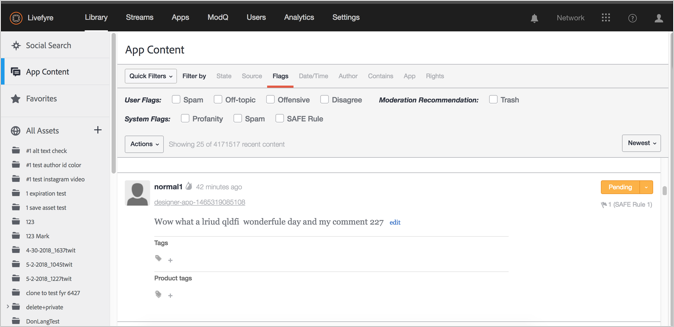
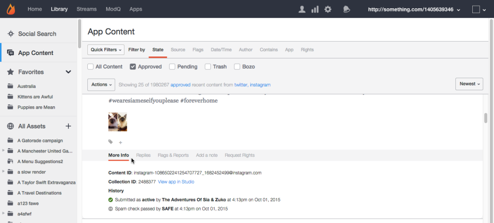

# Ficha Contenido de la aplicación{#app-content-tab}

Administración de contenido en la red de Livefyre.

La ficha Contenido de la aplicación de la biblioteca le permite buscar y moderar contenido publicado en las aplicaciones. La ficha **[!UICONTROL App Content]** permite varios filtros de búsqueda con búsqueda comodín, para permitirle definir más rápida y fácilmente los parámetros de búsqueda.

Utilice la ficha Contenido de la aplicación para:

* Buscar contenido
* Historial de contenido de vista
* Moderar contenido
* Agregar una etiqueta
* Contenido de las funciones
* Asociación de contenido con productos del catálogo de productos

Para obtener más información sobre cómo moderar contenido mediante la ficha Contenido de la aplicación, consulte .

## Búsqueda de comodines {#section_jvr_ntm_zz}

Los campos de búsqueda de Livefyre admiten caracteres comodín, que permiten agregar un asterisco ( *) a las palabras (o fragmentos de palabras) para capturar coincidencias parciales.

Por ejemplo:

* la bola sólo devuelve una bola
* La bola* devuelve la bola y el globo
* *la bola devuelve pelota y fútbol
* *bola* devuelve bola y unibola y bola de nieve

## Buscar contenido {#section_fw1_mtm_zz}

El panel Contenido de la aplicación le permite limitar la búsqueda mediante varias opciones de filtrado de contenido diferentes.

Utilice la conversión desplegable **[!UICONTROL Quick Filters]** para reducir el contenido devuelto al estado **[!UICONTROL All Content]**, **[!UICONTROL All Sidenotes]**, **[!UICONTROL Approved]**, **[!UICONTROL Approved & Flagged]**, **[!UICONTROL Pending]** o **[!UICONTROL Rights Requests]**. A continuación, seleccione una opción **[!UICONTROL Filter by]** y utilice las casillas de verificación o los campos de entrada disponibles para limitar la búsqueda.

Utilice el menú desplegable para ordenar el contenido de la lista por **[!UICONTROL Newest]**, **[!UICONTROL Oldest]**, **[!UICONTROL Recently updated]**, **[!UICONTROL Most flags]** o **[!UICONTROL Most liked]**.

## Filtrar por opciones {#section_aqn_xqm_zz}

Utilice la barra **[!UICONTROL Filter by]** para filtrar por las siguientes opciones:

* **** EstadoLe permite filtrar por el estado de moderación actual del contenido:**  [!UICONTROL All Content]*,  **[!UICONTROL Approved]**,  **[!UICONTROL Pending]** o  **[!UICONTROL Bozo]**.

* **** OrigenLe permite filtrar por la fuente del contenido. Seleccione **[!UICONTROL Livefyre]** para lista el contenido generado por el usuario publicado directamente en el flujo. Seleccione **[!UICONTROL Facebook]**, **[!UICONTROL Twitter]** o **[!UICONTROL RSS]** para incluir el contenido extraído en las aplicaciones de esas fuentes.

* **** IndicadoresSeleccionar indicadores permite filtrar por  **[!UICONTROL User Flags]** (correo no deseado, fuera de tema, ofensivo o en desacuerdo),  **[!UICONTROL System Flags]** aplicado por SAFE (lenguaje vulgar, correo no deseado o moderado mágicamente) o  **[!UICONTROL Moderation Recommendations]**.  

* **Fecha y** horaLe permite filtrar por el momento en que el contenido se introdujo originalmente  **[!UICONTROL Created]** (o se insertó en la aplicación a través de SocialSync o un flujo), o por último  **[!UICONTROL Modified]** (editado, marcado o modificado el estado).

* **** AutorLe permite filtrar por la  **[!UICONTROL IP]** dirección del autor  **[!UICONTROL Display Name]** (que se encuentra en el panel Usuarios o por encima del contenido publicado por el autor) o  **[!UICONTROL User ID]**(que se encuentra en el panel Usuarios).

* **** ContieneLe permite filtrar los últimos 90 días de contenido por  **[!UICONTROL Keyword]** o  **[!UICONTROL Content Tag]**. Seleccione la casilla **[!UICONTROL Media]** para devolver solo el contenido que contenga medios. (Para buscar todo el contenido, desplácese hacia abajo por todo el contenido de la lista y haga clic en **[!UICONTROL Search full data]**).

   **Nota:No se admite la búsqueda de** varias palabras clave y etiquetas de contenido. Si se introducen varias palabras clave o etiquetas, se utilizará la última palabra para la búsqueda.

   Al buscar por etiqueta de contenido, las etiquetas sugeridas se rellenarán automáticamente al escribir en el campo de búsqueda. Los resultados de la búsqueda devolverán todo el contenido al que se le haya asignado la etiqueta. (Utilice este campo para buscar contenido destacado o haga clic en la etiqueta **[!UICONTROL Featured]** de cualquier contenido destacado de Studio).

   **Nota:** Utilice un signo menos (-) antes del nombre de una etiqueta para buscar contenido que no incluya esa etiqueta. Por ejemplo: Busque ‘-Miley’ para buscar todo el contenido que no incluya la etiqueta ‘Miley’.

* **** AplicaciónLe permite filtrar por  **[!UICONTROL Collection ID]**,  **[!UICONTROL App Tag]** o por ID **** principal. El filtrado por ID principal devuelve todo el contenido que responde a la ID de contenido de entrada. (Filtre por varias etiquetas introduciendo etiquetas separadas por una coma).

* **** DerechosLe permite filtrar por estado de solicitudes de derechos:**  [!UICONTROL Requested]*,  **[!UICONTROL Granted]**,  **[!UICONTROL Replied]** o  **[!UICONTROL Expired]**.

## Contenido Bozo {#section_afl_vqm_zz}

En Aplicaciones, el contenido **[!UICONTROL Bozo]** solo se muestra al autor del contenido. Esto permite al usuario creer que el contenido ha sido aprobado, ocultándolo a todos los demás usuarios y moderadores.

>[!NOTE]
>
>El contenido social que se origina en SocialSync o en los flujos **[!UICONTROL cannot]** se debe establecer en Bozo.

Puede usar contenido de Bozo por los siguientes motivos:

* El contenido identificado como correo no deseado por SAFE se establece automáticamente en el estado Bozo.
* Todo el contenido de los usuarios prohibidos se establece automáticamente en Bozo.
* El contenido puede marcarse como Bozo desde Studio.
* Los moderadores pueden incluir contenido Bozo directamente en el flujo.

## Historial de contenido de vista {#section_ayz_tqm_zz}

El panel de contenido le permite revisar el historial de todo el contenido de la lista, incluida la moderación previa, el filtrado de contenido no deseado, la fecha de la publicación y los indicadores o notas de usuario asignados al elemento.

Utilice las fichas de la parte inferior del panel de contenido para vista de su historial.

* **[!UICONTROL More Info:]** lista toda la actividad sobre este contenido, incluido el envío, la edición, la comprobación de spam, el cambio de estado y las notas. La ID de contenido de Livefyre y la dirección IP del usuario también se muestran en esta sección.
* **[!UICONTROL Replies:]** lista un máximo de 6 respuestas. Haga clic en **[!UICONTROL Show all replies]** para mostrar todas las respuestas a la publicación.

* **[!UICONTROL Flags & Reports:]** lista todos los indicadores de usuario, con el avatar del usuario que marcó el contenido y cualquier informe (notas que el usuario agregó al marcar el contenido).
* **[!UICONTROL Add a note:]** permite agregar una nota, visible para otros administradores o moderadores.
* **[!UICONTROL Request Rights:]** abre el  **[!UICONTROL New Rights Request]** cuadro de diálogo, desde el cual se puede emitir una solicitud de derechos.

* **[!UICONTROL Save as Asset:]**abre el cuadro de diálogo **[!UICONTROL Advanced Options]**, que le permite guardar el elemento seleccionado en la biblioteca de recursos, publicarlo en una aplicación o solicitar derechos de reutilización a su autor.

## Añadir una etiqueta a contenido {#section_xb4_mxr_rdb}

El etiquetado de contenido permite categorizar y organizar el contenido para facilitar la recuperación y la personalización de estilo, o marcar el contenido como destacado.

Para agregar etiquetas, haga clic en el icono más ( **[!UICONTROL +]**) debajo del contenido. Introduzca una nueva etiqueta o selecciónela de una lista de etiquetas existentes.

## Búsqueda de imágenes en todos los recursos {#section_zxf_hsf_wcb}

Una vez agregado el contenido a la biblioteca, puede buscar el contenido mediante etiquetas inteligentes.

En la biblioteca, en Todos los recursos, puede buscar las imágenes existentes haciendo clic en **[!UICONTROL Show Filters]** y, a continuación:

* Introducción de texto para buscar en el campo de búsqueda
* Clasificación por relevancia
* Introducción de texto en el campo **[!UICONTROL Tags]** para buscar por Etiquetas inteligentes. El algoritmo de clasificación de etiquetas inteligentes filtros el contenido mediante una puntuación de confianza de etiquetas inteligentes, la novedad del contenido y la cantidad de estrellas que un usuario ha dado al contenido.

## Contenido destacado {#section_emb_kqm_zz}

Seleccione la etiqueta predeterminada **[!UICONTROL Featured]** para marcar el contenido como destacado y resaltarlo como importante para los usuarios. Una vez etiquetados, utilice las opciones de estilo personalizadas para personalizar el contenido destacado en las aplicaciones.

## Para destacar o anular la función de contenido {#section_ojx_3qm_zz}

* En Studio, haga clic en el signo **[!UICONTROL +]** situado junto a un fragmento de contenido, seleccione la etiqueta **[!UICONTROL Featured]** en la lista desplegable y haga clic en **[!UICONTROL Enter]** para mostrar el contenido de la función. La etiqueta se guardará y se mostrará al lado del contenido.

* Para cancelar la función, haga clic en la **[!UICONTROL x]** en la etiqueta **[!UICONTROL Featured]** que se muestra en el contenido.

* Desde la aplicación Comentarios, Live Blog o Reseñas, pase el ratón por encima del contenido que desee destacar y haga clic en **[!UICONTROL Feature]**. Para desactivar la función, simplemente coloque el puntero sobre el contenido y haga clic en **[!UICONTROL Unfeature]**.

>[!NOTE]
>
>Debido a las limitaciones de espacio, el contenido de chat solo se puede mostrar o dejar de mostrar con Studio y puede que no aparezca desde la propia aplicación.

## Edición del contenido destacado {#section_pyw_hqm_zz}

Las acciones más frecuentes sobre el contenido se pueden realizar en el contenido destacado, con la excepción de lo siguiente:

* El contenido destacado no se puede marcar.
* Los usuarios no pueden editar su contenido una vez que se ha destacado, aunque sí pueden eliminarlo si lo desean. Los moderadores pueden editar el contenido destacado.

