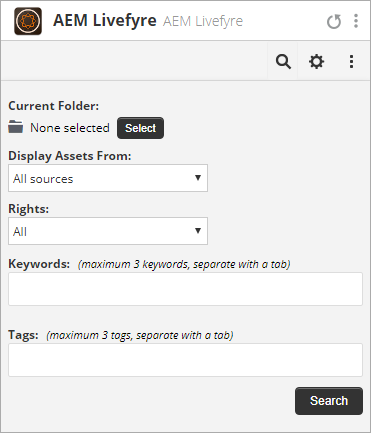

# Uso de Adobe Experience Manager Livefyre con Hootsuite{#use-adobe-experience-manager-livefyre-with-hootsuite}

Aprenda a utilizar Experience Manager Livefyre con Hootsuite, permitiéndole depurar, administrar y compartir contenido generado por usuarios directamente desde el panel de Hootsuite.

## Uso de Adobe Experience Manager Livefyre con Hootsuite {#topic_FB6E613DBCF74F39ABD5045C501EA326}

Aprenda a utilizar Experience Manager Livefyre con Hootsuite, permitiéndole depurar, administrar y compartir contenido generado por usuarios directamente desde el panel de Hootsuite.

## Primeros pasos {#task_22699BD901C24384AB2DC02D926D8F4A}

Contexto de tarea

1. Instale Adobe Experience Manager Livefyre para Hootsuite desde el directorio de aplicaciones Hootsuite.

1. Desde el tablero de Hootsuite, haga clic **en Iniciar sesión con Adobe**.

   

1. Inicie sesión en Experience Manager Livefyre con sus credenciales de Livefyre.
1. Haga clic **en Autorizar** para otorgar permiso a Hootsuite para acceder a las bibliotecas.

   

   Una vez que conceda permiso, volverá al tablero de Hootsuite donde puede buscar recursos en las bibliotecas de Experience Manager Livefyre.

## Buscar recursos {#task_0B011B0C539E400BB72A6DF69FBF66C0}

Contexto de tarea

1. Haga clic en el icono de búsqueda de la barra de menús para buscar recursos en las bibliotecas de Experience Manager Livefyre.

   

1. Haga clic **en Seleccionar** y aparecerá una ventana emergente con todas las bibliotecas.
1. Haga clic en la carpeta de una biblioteca y, a continuación, haga clic **en Seleccionar carpeta** para seleccionar la biblioteca que se mostrará en el flujo de Hootsuite.

   

## Opciones de filtro {#concept_5D062A9CD61A4B2E90784E5AA31CB16D}

Puede filtrar los resultados de la búsqueda utilizando las secciones Mostrar recursos de, Derechos, Palabras clave y Etiquetas.

Las opciones de filtrado incluyen:

| Sección | Descripción |
|--- |--- |
| Mostrar recursos desde | Seleccione para ver recursos desde todas las fuentes o desde una fuente individual. Por ejemplo: Instagram, Twitter, Facebook, etc. |
| Derechos | Seleccione para ver solo los recursos que tengan una configuración de derechos específica. |
| Palabras clave | Seleccione para filtrar los resultados por palabras clave o etiquetas. Al filtrar por palabras clave, se buscará el contenido de texto de un anuncio y el nombre de usuario y el nombre de usuario del autor. |
| Etiquetas | Seleccione para filtrar los resultados por palabras clave o etiquetas. Al filtrar por palabras clave, se buscará el contenido de texto de un anuncio y el nombre de usuario y el nombre de usuario del autor. |

Cuando haya seleccionado los parámetros de búsqueda, los recursos se mostrarán en flujo al buscar:

### Opciones del menú Flujo

Si hace clic en el nombre o el icono del usuario, se mostrará al usuario en la red correspondiente. Al hacer clic en la hora, se mostrará el artículo original. Cuando el ratón se encuentre sobre el elemento, aparecerán más opciones. Haga clic en Compartir 

agregará el activo actual al cuadro de composiciones de red, permitiéndole compartirlo con sus redes mediante Hootsuite.

>[!NOTE]
>
>El botón de uso compartido solo aparecerá cuando se filtre por recursos con derechos concedidos.

Haga clic en  el icono Asignar para asignar el elemento actual a uno de los miembros del equipo de Hootsuite. Si ya se ha asignado un elemento, el 

aparecerá el icono. Haga clic en él para resolver la asignación actual.

### Otros menús de la aplicación

Haga clic en la configuración 

le permitirá desconectar la cuenta de Livefyre de Experience Manager actual y conectarse con otra.

Haga clic en el menú 

mostrará vínculos para este documento, compatibilidad y sitio Web de Synaptive.

## Experience Manager Livefyre App Plugin {#task_33C8CEF4F5E44830B970BB3A7AAA2AA6}

Además de mostrar las bibliotecas de recursos en un flujo de Hootsuite, también puede guardar elementos de Instagram, Twitter, Facebook y YouTube en las bibliotecas de Experience Manager Livefyre.

1. Haga clic en el icono de menú que aparece en la parte inferior de cada elemento.

   

1. Seleccione **Enviar a AEM Livefyre**.
1. Seleccione una o varias bibliotecas para guardar el recurso.

   

1. Haga clic **en Guardar en la biblioteca** y el elemento se guardará en las bibliotecas seleccionadas.

## Componente de la biblioteca de medios de Experience Manager Livefyre {#task_9CA2D5D49F8E463F9EF475BC09C8ACC9}

Puede acceder a sus recursos a través de los componentes multimedia del Compositor de grupos de Hootsuite.

1. Desde el Compositor, haga clic en el **vínculo Abrir biblioteca** de medios en **la** sección Medios.

   

1. Seleccione Adobe Experience Manager Livefyre en el menú desplegable y se mostrarán los archivos.

   

1. Para agregar un recurso al anuncio actual que está escribiendo, haga clic en él. Para buscar un recurso específico, ingrese los términos de búsqueda en el cuadro **Buscar medios** y se mostrarán los resultados.
