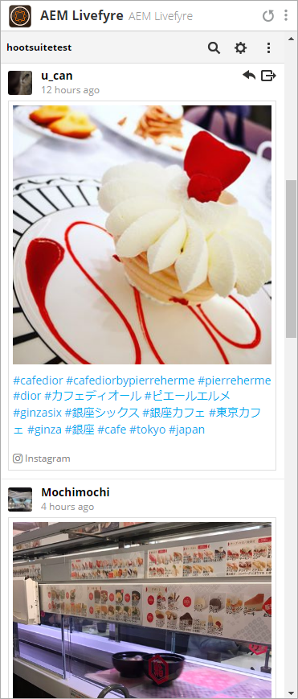

# Usar Adobe Experience Manager Livefyre con Hootsuite{#use-adobe-experience-manager-livefyre-with-hootsuite}

Aprenda a utilizar el Experience Manager Livefyre con Hootsuite, lo que le permite depurar, administrar y compartir contenido generado por el usuario directamente desde el panel Hootsuite.

## Usar Adobe Experience Manager Livefyre con Hootsuite {#topic_FB6E613DBCF74F39ABD5045C501EA326}

Aprenda a utilizar el Experience Manager Livefyre con Hootsuite, lo que le permite depurar, administrar y compartir contenido generado por el usuario directamente desde el panel Hootsuite.

## Introducción {#task_22699BD901C24384AB2DC02D926D8F4A}

Contexto de tarea

1. Instale Adobe Experience Manager Livefyre para Hootsuite desde el Directorio de aplicaciones Hootsuite.

1. En el panel Hootsuite, haga clic en **Iniciar sesión con Adobe**.

   

1. Inicie sesión en el Experience Manager Livefyre con sus credenciales de Livefyre.
1. Haga clic en **Autorizar** para conceder permiso a Hootsuite para acceder a sus bibliotecas.

   

   Una vez que conceda el permiso, volverá al panel Hootsuite, donde podrá buscar recursos en sus bibliotecas de Experience Manager Livefyre.

## Buscar recursos {#task_0B011B0C539E400BB72A6DF69FBF66C0}

Contexto de tarea

1. Haga clic en el icono de búsqueda de la barra de menús para buscar recursos en las bibliotecas de Livefyre de su Experience Manager.

   

1. Haga clic en **Seleccionar** y se mostrará una ventana emergente con todas sus bibliotecas.
1. Haga clic en la carpeta de una biblioteca y, a continuación, haga clic en **Seleccionar carpeta** para seleccionar la biblioteca que se mostrará en el flujo de Hootsuite.

   

## Opciones de filtro {#concept_5D062A9CD61A4B2E90784E5AA31CB16D}

Puede filtrar los resultados de búsqueda mediante las secciones Mostrar recursos de, Derechos, Palabras clave y Etiquetas .

Las opciones de filtrado incluyen:

| Sección | Descripción |
|--- |--- |
| Mostrar recursos de | Seleccione esta opción para ver los recursos de todas las fuentes o de una fuente individual. Por ejemplo: Instagram, Twitter, Facebook, etc. |
| Derechos | Seleccione para ver solo los recursos que tengan una configuración de derechos específica. |
| Palabras clave | Seleccione para filtrar los resultados por Palabras clave o Etiquetas. El filtrado por palabras clave buscará el contenido de texto de una publicación, así como el nombre para mostrar del autor y el nombre de usuario del autor. |
| Etiquetas | Seleccione para filtrar los resultados por Palabras clave o Etiquetas. El filtrado por palabras clave buscará el contenido de texto de una publicación, así como el nombre para mostrar del autor y el nombre de usuario del autor. |

Una vez que haya seleccionado los parámetros de búsqueda, los recursos se mostrarán en flujo cuando realice la búsqueda:

### Opciones del menú Flujo

Al hacer clic en el nombre o icono del usuario, se mostrará el usuario en la red correspondiente. Al hacer clic en la hora se mostrará el artículo original. Cuando el ratón esté sobre el elemento, aparecerán más opciones. Hacer clic en Compartir 

agregará el recurso actual al cuadro de composición de red, lo que le permitirá compartirlo con sus redes a través de Hootsuite.

>[!NOTE]
>
>El botón Compartir solo aparece cuando se filtran recursos con derechos concedidos.

Haga clic en el icono Asignar  para asignar el elemento actual a uno de los integrantes del equipo de Hootsuite. Si ya se ha asignado un elemento, la opción Resolver 

se mostrará. Haga clic en él para resolver la asignación actual.

### Otros menús de aplicación

Hacer clic en Configuración 

le permitirá desconectar la cuenta actual del Experience Manager Livefyre y conectarse con otra.

Hacer clic en el menú 

mostrará vínculos para este documento, soporte técnico y sitio web de Synaptive.

## Complemento de aplicación de Livefyre del Experience Manager {#task_33C8CEF4F5E44830B970BB3A7AAA2AA6}

Además de poder mostrar las bibliotecas de recursos en un flujo de Hootsuite, también puede guardar elementos de los flujos de Instagram, Twitter, Facebook y YouTube en las bibliotecas de Livefyre de su Experience Manager.

1. Haga clic en el icono Menú que se encuentra en la parte inferior de cada elemento.

   

1. Seleccione **Send to AEM Livefyre**.
1. Seleccione una o varias bibliotecas en las que guardar el recurso.

   

1. Haga clic en **Guardar en biblioteca** y el elemento se guardará en las bibliotecas seleccionadas.

## Componente Media Library de Livefyre del Experience Manager {#task_9CA2D5D49F8E463F9EF475BC09C8ACC9}

Puede acceder a sus recursos a través de los componentes multimedia del Compositor de Hootsuite.

1. En el Compositor, haga clic en el enlace **Abrir Media Library** en la sección **Medios**.

   

1. Seleccione Adobe Experience Manager Livefyre en el menú desplegable y se mostrarán sus archivos.

   

1. Para agregar un recurso al anuncio actual que está escribiendo, haga clic en él. Para buscar un recurso específico, escriba los términos de búsqueda en el cuadro **Buscar medios** y se mostrarán los resultados.
