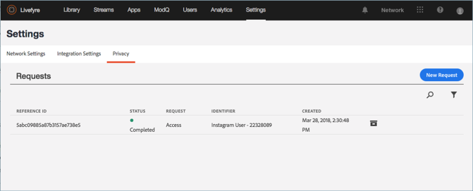

# Crear una solicitud de privacidad{#create-a-privacy-request}

Cree una solicitud de privacidad en Livefyre.

Elimine todos los datos de un usuario, genere un informe de todos los datos de un usuario y realice cambios de participación o de exclusión mediante este proceso.

Para buscar y encontrar un usuario y generar un informe de su contenido:

1. Vaya a **[!UICONTROL Settings > Privacy]** y haga clic en **[!UICONTROL Create Request]**.

   

1. Rellene la información de la ventana **[!UICONTROL Submit Request]**:

   * **[!UICONTROL Reference Id]**. Introduzca un identificador para utilizarlo en futuras referencias. Por ejemplo, puede agregar texto, un número de ticket, una dirección URL, una dirección de correo electrónico u otra cadena de hasta 255 caracteres
   * **[!UICONTROL Type]**

      * **Acceso**. Recopila todos los datos disponibles asociados con la cuenta. Los detalles confidenciales, por ejemplo, contraseñas o credenciales sociales, se confundirán o se omitirán.

      * **Eliminar**. Celebra o confunde todos los datos asociados con la cuenta. **Si elige esta opción y hace clic en Enviar, no podrá revertir ni cancelar esta acción  *ni recuperar los datos eliminados.*** Si la cuenta pertenece a un usuario de Livefyre Studio, se conservarán algunos datos para mantener la integridad de los registros comerciales.

         >[!IMPORTANT]
         >
         >Al eliminar datos de una cuenta, se eliminarán o destruirán de forma permanente los datos asociados con ella. No puede revertir esta acción ni recuperar datos después de eliminarla.

      * **Exclusión**. Evita que Livefyre recopile de forma pasiva datos o contenido de una cuenta social a través de flujos o búsqueda social. La inclusión y la exclusión no se aplican a los usuarios registrados
      * **Inclusión**. Rehabilita Livefyre para recopilar de forma pasiva datos o contenido de una cuenta social que antes había optado por los flujos o la búsqueda social. La inclusión y la exclusión no se aplican a los usuarios registrados

      

   * **[!UICONTROL Identifier Type]** y **[!UICONTROL Identifier]**

      * **[!UICONTROL User Account]**

         * Identifica una cuenta de un usuario registrado mediante el ID de cuenta de usuario generado por el sistema de administración de usuarios o el identificador de usuario de estudio de Livefyre. También puede encontrar el ID de cuenta de usuario en Detalles del usuario en **Livefyre** **Configuración de usuario** o en los detalles del contenido de la **Biblioteca de recursos** o **Contenido de la aplicación**

         * Valores permitidos: Cadena alfanumérica de hasta 255 caracteres. Una dirección de correo electrónico no es una entrada válida
      * **[!UICONTROL Facebook User]**

         * Identifica una cuenta con un ID numérico proporcionado por Facebook. El solicitante debe proporcionar esto. Aquí](https://www.facebook.com/help/1397933243846983?helpref=faq_content) encontrará instrucciones sobre cómo localizar el ID numérico de Facebook [
         * Valores permitidos: 6-16 caracteres numéricos
      * **[!UICONTROL Instagram User]**

         * Identifica la cuenta con un ID numérico proporcionado por Instagram. El solicitante debe proporcionar esto. Puede encontrar instrucciones sobre cómo ubicar el ID numérico de Instagram en una cuenta de Instagram buscando en línea
         * Valores permitidos: 5-16 caracteres numéricos
      * **[!UICONTROL Twitter User]**

         * Identifica una cuenta con un ID numérico proporcionado por Twitter. La persona que solicita el cambio en la privacidad debe proporcionarlo. Puede encontrar instrucciones sobre cómo localizar el ID numérico de Twitter de una cuenta de Twitter buscando en línea
         * Valores permitidos: 5-16 caracteres numéricos
      * **[!UICONTROL YouTube User]**

         * Identifica una cuenta con un ID numérico proporcionado por YouTube. La persona que solicita el cambio en la privacidad debe proporcionarlo. Puede encontrar instrucciones sobre cómo ubicar el ID numérico de YouTube en una cuenta de YouTube [aquí](https://support.google.com/youtube/answer/3250431?hl=en)
         * Valores permitidos: 5-16 caracteres numéricos
      * **[!UICONTROL Generic Author]**

         * Identifica una cuenta mediante un ID de autor de Livefyre (JID). Utilice esta opción para el contenido procedente de RSS, Tumblr o URL. Para buscar este ID, busque el contenido atribuido al autor en **Contenido de la aplicación** o **Biblioteca de recursos** y, a continuación, seleccione un elemento. El ID está disponible en **Contenido de la aplicación** en **Información** o en la **Biblioteca de recursos** en **Autor** en la sección **Detalles**

         * Valores permitidos: Cadena alfanumérica de hasta 255 caracteres

         

1. Haga clic **[!UICONTROL Finish]**.

   

1. (Solo para solicitudes de eliminación) Confirme que desea eliminar toda la información del usuario.

   >[!IMPORTANT]
   >
   >Al eliminar datos de una cuenta, se eliminarán o destruirán de forma permanente los datos asociados con ella. No puede revertir esta acción ni recuperar datos después de eliminarla.

