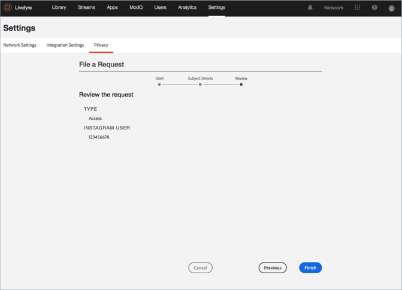

# Crear una solicitud de privacidad{#create-a-privacy-request}

Cree una solicitud de privacidad en Livefyre.

Elimine todos los datos de un usuario, genere un informe de todos los datos para un usuario y realice cambios de inclusión o exclusión mediante este proceso.

Para buscar y buscar un usuario y generar un informe de su contenido:

1. Vaya a **[!UICONTROL Settings > Privacy]**y, a continuación, haga clic **[!UICONTROL Create Request]**en.

   

1. Complete la información de **[!UICONTROL Submit Request]** la ventana:

   * **[!UICONTROL Reference Id]**. Introduzca un identificador para utilizarlo para la referencia futura. Por ejemplo, puede agregar texto, número de ticket, dirección URL, dirección de correo electrónico u otra cadena de hasta 255 caracteres
   * **[!UICONTROL Type]**

      * **Acceso**. Recopila todos los datos disponibles asociados a la cuenta. Los detalles confidenciales, por ejemplo, contraseñas o credenciales sociales, se confunden o se omiten.

      * **Eliminar**. Cancela o muestra toda la información asociada a la cuenta. **Si elige esta opción y hace clic en Enviar, no puede revertir ni cancelar esta acción, *ni puede recuperar los datos eliminados.*** Si la cuenta pertenece a un usuario de Livefyre Studio, se conservarán algunos datos para mantener la integridad de los registros comerciales.

         >[!IMPORTANT]
         >
         >Al eliminar datos de una cuenta, se eliminarán o eliminarán de forma permanente los datos asociados con la cuenta. No puede invertir esta acción ni puede recuperar los datos después de eliminarla.

      * **Exclusión**. Evita que Livefyre recopile de forma pasiva datos o contenido de una cuenta social a través de Flujos o Búsqueda social. La inclusión y exclusión no se aplican a los usuarios registrados
      * **Inclusión**. Volver a habilitar Livefyre para recopilar de forma pasiva datos o contenido de una cuenta social que antes estaba activada mediante flujos o búsqueda social. La inclusión y exclusión no se aplican a los usuarios registrados
      

   * **[!UICONTROL Identifier Type]** y **[!UICONTROL Identifier]**

      * **[!UICONTROL User Account]**

         * Identifica una cuenta de un usuario registrado por el ID de cuenta de usuario generado por el identificador de usuario de usuario de su sistema o de Livefyre Studio. También puede localizar el ID de cuenta de usuario en los detalles del usuario para el usuario en **la configuración** **del usuario de Livefyre** o en los detalles del contenido de la biblioteca **de recursos** o del contenido **de la aplicación**

         * Valores permitidos: Cadena alfanumérica de hasta 255 caracteres. Una dirección de correo electrónico no es una entrada válida
      * **[!UICONTROL Facebook User]**

         * Identifica una cuenta mediante un ID numérico proporcionado por Facebook. El solicitante debe proporcionarlo. Puede encontrar instrucciones sobre cómo ubicar el ID numérico de Facebook [aquí](https://www.facebook.com/help/1397933243846983?helpref=faq_content)
         * Valores permitidos: 6-16 caracteres numéricos
      * **[!UICONTROL Instagram User]**

         * Identifica la cuenta mediante un ID numérico proporcionado por Instagram. El solicitante debe proporcionarlo. Puede encontrar instrucciones sobre cómo localizar el ID numérico de Instagram en una cuenta de Instagram buscando en línea
         * Valores permitidos: 5-16 caracteres numéricos
      * **[!UICONTROL Twitter User]**

         * Identifica una cuenta mediante un ID numérico proporcionado por Twitter. La persona que solicita el cambio de privacidad debe proporcionarla. Puede encontrar instrucciones sobre cómo localizar el ID numérico de Twitter para una cuenta de Twitter buscando en línea
         * Valores permitidos: 5-16 caracteres numéricos
      * **[!UICONTROL YouTube User]**

         * Identifica una cuenta mediante un ID numérico proporcionado por YouTube. La persona que solicita el cambio de privacidad debe proporcionarla. Puede encontrar instrucciones sobre cómo ubicar el ID de YouTube numérico en una cuenta de YouTube [aquí](https://support.google.com/youtube/answer/3250431?hl=en)
         * Valores permitidos: 5-16 caracteres numéricos
      * **[!UICONTROL Generic Author]**

         * Identifica una cuenta por ID de autor de Livefyre (JID). Utilice esta opción para crear contenido mediante RSS, Tumblr o URL. Para encontrar este ID, busque contenido atribuido al Autor en **la biblioteca de** **contenido o contenido de la aplicación**y, a continuación, seleccione un elemento. El ID está disponible en Contenido **de la aplicación** en **Información** o en la Biblioteca **de recursos** , dentro **de Autor** en **la** sección Detalles.

         * Valores permitidos: Cadena alfanumérica de hasta 255 caracteres
         

1. Haga clic **[!UICONTROL Finish]**en.

   

1. (Solo para solicitudes de eliminación) Confirme que desea eliminar toda la información del usuario.

   >[!IMPORTANT]
   >
   >Al eliminar datos de una cuenta, se eliminarán o eliminarán de forma permanente los datos asociados con la cuenta. No puede invertir esta acción ni puede recuperar los datos después de eliminarla.

