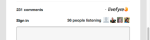
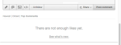
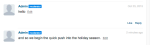
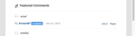
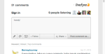
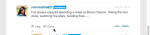

# Localización de cadenas{#localize-strings}

Personalización de las cadenas de las aplicaciones de Livefyre.

Las cadenas de texto de la mayoría de los elementos HTML de cualquier aplicación de Livefyre pueden personalizarse. Esto proporciona la flexibilidad de cambiar el texto de los elementos HTML procesados, como el botón «Publicar como», el texto «Recuento de comentarios» o el botón «Iniciar sesión», a cualquier cadena UTF -8 válida. Utilice esta función para añadir personalidad a la implementación del flujo o para localizar el idioma en la aplicación para su base de usuarios.

* Comentarios, chat y blog activo

   * [Implementación](#c-localize-strings/section_im4_224_xz)
   * [Acceso a cuenta](#c-localize-strings/section_cm3_d24_xz)
   * [Información del flujo](#c-localize-strings/section_wx1_c24_xz)
   * [Ordenación de flujo](#c-localize-strings/section_ih2_124_xz)
   * [Información de contenido](#c-localize-strings/section_llv_yd4_xz)
   * [Contenido destacado](#c-localize-strings/section_gmw_vd4_xz)
   * [Editor de texto](#c-localize-strings/section_ky5_td4_xz)
   * [Opciones de respuesta](#c-localize-strings/section_zvt_qd4_xz)
   * [Notificador de comentarios](#c-localize-strings/section_qqt_pd4_xz)
   * [Mensajes de error](#c-localize-strings/section_omz_jxn_xz)

* [Formato de fecha y hora](#c-localize-strings/section_yz4_g5n_xz)
* [Muro de medios](#c-localize-strings/section_vwt_d5n_xz)
* [Mapa](#c-localize-strings/section_fxv_c5n_xz)
* [Mosaico](#c-localize-strings/section_e2s_b5n_xz)
* [Carrusel](#c-localize-strings/section_l2z_hkn_xz)
* [Tarjeta de función](#c-localize-strings/section_mw2_hkn_xz)
* [Encuesta](#c-localize-strings/section_pdg_fwh_xz)
* [Identidad de Livefyre](#c-localize-strings/section_zc3_xvh_xz)
* Más:
   * [Revisar cadenas de texto](/help/using/c-settings-other/c-translation-sets/c-review-text-strings.md#c_review_text_strings)
   * [Sidenotes](/help/using/c-settings-other/c-translation-sets/c-sidenotes-text-strings.md#c_sidenotes_text_strings)

## Implementación {#section_im4_224_xz}

Para implementar esta función, pase una asignación de objeto 1-1 de las cadenas que desee sobrescribir al objeto de configuración JavaScript. Si no proporciona un campo, se utilizará el texto predeterminado.

Ejemplo:

```
var customStrings = {     
   postAsButton: "New Post As Text",     
   postEditButton: "New Post Edit Text"  
};   
   convConfig["strings"] = customStrings; fyre.conv.load(     
   networkConfig,     
   [convConfig],     
   function(){}  
);
```

Esta página enumera todas las cadenas de texto que pueden personalizarse para las aplicaciones principales de Livefyre.

## Acceso a cuenta {#section_cm3_d24_xz}

Cadenas disponibles para el proceso de autenticación y desde los menús de usuario autenticados.



| Elemento | Clave | Texto predeterminado |
|---|---|---|
|  | Displayname | % s |
|  | Editprofile | Editar perfil |
|  | Notificationsettings | Configuración de notificación |
|  | Siteadmin | Consola de administración (vínculos a Studio) |
|  | Signout | Cerrar sesión |

## Información del flujo {#section_wx1_c24_xz}

Cadenas disponibles para la información de flujo de contenido y visualización. Muestra el número de personas que escucha, el número de publicaciones en la aplicación y permite que los usuarios inicien sesión o accedan a la información de su cuenta.

| Clave | Texto predeterminado | Datos de flujo |
|---|---|---|
|  | Commentcountlabelzero | Comentario % s |
|  | Commentcountlabel | Comentario % s |
|  | Commentcountlabelplural | Comentarios % s |
|  | Listenercount | persona que escucha |
|  | Listenercountplural | personas que escucha |
|  | Liveblogpostcountlabelzero | post |
|  | Liveblogpostcountlabel | post |
|  | Liveblogpostcountlabelplural | anuncios |
| Opciones de debate | Threadbreakoutbutton | Mostrar todo el hilo |
|  | Alternar contracción | Conmutar contraer |
| Comentarios de alta velocidad/en cola | actualizar | Actualizar |
|  | Newcomment | Nuevo comentario |
|  | Newcomments | Comentarios nuevos |
|  | Newreply | nueva respuesta |
|  | Newanswers | nuevas respuestas |

## Ordenación de flujo {#section_ih2_124_xz}

Permite utilizar para ordenar el contenido devuelto por edad o popularidad.



| Clave | Texto predeterminado | Opciones de encabezado |
|---|---|---|
|  | Sortnewest | Más reciente |
|  | Sortoldest | Más antiguos |
|  | Sorttopcomments | Comentarios principales |
|  | Sorthotthreads | Hilos interactivos |
|  | Sortseparator |  |  |
|  | Streamsorting | Cargando |
|  | Topcommentscontentnotfoundmsg | Aún no hay suficiente cantidad de "Me gusta". |
|  | Hotthreadscontentnotfoundmsg | Aún no hay suficientes subprocesos. |
|  | Streamrefreshmsg | Consulte las novedades. |
| Opciones de Pie de página | Archiveheadertitle | Desde el archivo |
|  | Archiveshowmore | Mostrar más |
|  | Showmore | Mostrar más comentarios |
|  | Showmoreliveblog | Mostrar más anuncios |


## Información de contenido {#section_llv_yd4_xz}

Enumera la información del anuncio: nombre de usuario, cualquier etiqueta de usuario aplicada y hora de publicación.

  

| Clave | Texto predeterminado | Autor |
|---|---|---|
|  | moderador | moderador |
|  | Hovercardviewprofile | Ver perfil completo |
| Información de anuncio | Timejustnow | just now |
|  | Timeminutesago | minuto atrás |
|  | Timeminutesagoplural | minutos atrás |
|  | Timehoursago | hora atrás |
|  | Timehoursagoplural | horas atrás |
|  | Timedaysago | día anterior |
|  | Timedaysagoplural | días antes |
|  | Likesplural | Cantidad de "Me gusta" |
|  | Likessingular | Me gusta |
|  | Moderatoredittimestamp | Editado por un moderador |
|  | Commenttombstone | Se eliminó este comentario |
|  | Permalinknotfoundmsg | Este comentario ya no está visible. |
|  | Quickprofiletooltip | Perfil rápido |

## Contenido destacado {#section_gmw_vd4_xz}

Si se habilita, el contenido destacado aparece en la parte superior del flujo.

|  | Clave | Texto predeterminado |
|---|---|---|
| Etiquetas destacadas |  |  |
|  | Featuredcommentstag | Destacado |
|  | Featuredcommentstitleplural | Comentarios destacados |

## Editor de texto {#section_ky5_td4_xz}

De forma predeterminada, disponible en la parte superior de la página para todos los usuarios.



|  | Clave | Texto predeterminado |
|---|---|---| 
| Botones Editor | seguir | + Seguir |
|  | dejar de seguir | - Dejar de seguir |
|  | Liveblogfollow | Seguir blog activo |
|  | Liveblogunfollow | Unfollow Live Blog |
|  | Postbutton (disponible para usuarios registrados). | Publicar comentario |
|  | Postasbutton (disponible para usuarios no autenticados). | Publicar comentario como… |
|  | Posteditbutton | Editar comentario |
|  | Posteditasbutton | Editar comentario como… |
|  | Posteditcancelbutton | Cancelar |
|  | Editordisabled | Esta conversación está cerrada a los nuevos comentarios. |
| Opciones de chat | Livechatpostbuttonlabel | Anuncio |
|  | Livechatposteditbutton | Editar |
|  | Livechatwindowsinstruction | Pulse Control + Intro para publicar |
|  | Livechatotherinstruction | Pulse comando + intro para anunciar |

## Opciones de respuesta {#section_zvt_qd4_xz}

A menos que se indique lo contrario, disponible para todos los usuarios que iniciaron sesión. Pase el ratón sobre un panel de contenido para acceder.


| Clave | Texto predeterminado |  |
|---|---|---|
| Opciones de respuesta de usuario | Disponible para usuarios finales. |  |
| Flagbutton | Indicador |
|  | Flagcommenttooltip | Indicador |
|  | Editbutton (disponible solo para autores y moderadores, si está habilitado). | Editar |
|  | Deletebutton (disponible sólo para autores y moderadores, si está habilitado). | Eliminar |
|  | Deletecommenttooltip | Eliminar |
|  | Sharebutton | Compartir |
|  | Sharecommenttooltip | Compartir |
|  | Francisco LikeButton | Me gusta |
|  | Unrambutton | A diferencia de |
|  | Replybutton | Responder |
|  | Replybuttonunique (disponible para chat y blog activo). | Responder |
|  | Replybuttonplural (disponible para chat y blog activo). | Respuestas |



| Clave | Texto predeterminado |  |
|---|---|---|
| Modal modal | Flagtitle | Comentario de indicador % s |
|  | Flagsubtitle | Marcar como |
|  | Flagdefaultselectoption | Seleccionar |
|  | Flagole | Correo no deseado |
|  | Flagspambutton | Correo no deseado |
|  | Flagspamcommenttooltip | Correo no deseado |
|  | Flagofensiva | Ofensiva |
|  | Flagoffensivebutton | Ofensiva |
|  | Flagoffensivecommenttooltip | Ofensiva |
|  | Flagrechazar | Rechazar |
|  | Flagdisagreebutton | Rechazar |
|  | Flagdisagreecommenttooltip | Rechazar |
|  | Flagofftopic | Tema desactivado |
|  | Flagofftopicbutton | Tema desactivado |
|  | Flagofftopiccommenttooltip | Tema desactivado |
|  | Flagemail | Correo electrónico |
|  | Rasemailplaceholder | you@example.com |
|  | Notas de flagnote | Notas |
|  | Flagnotesplaceholder | Empiece a escribir aquí… |
|  | Flagconfirmbutton | OK |
|  | Flagcancelbutton | Cancelar |
|  | Flagconfirmationmessage | ¿Marcar comentario % s como % s? |
|  | Flagsuccessmsg | Se marcó el comentario. |


| Clave | Texto predeterminado |  |
|---|---|---|
| Modal | Sharetitle | Compartir comentario |
|  | Shareplaceholdertext | ¿Qué piensa? |
|  | Sharelabel | Compartir en: |
|  | Sharetexttwitter | blank |
|  | Sharetextfacebook | blank |
|  | Sharetextlinkedin | blank |
|  | Sharebuttontext | Compartir |
|  | Sharepermalink | Permalink |
|  | Loadingpermalink | Cargando dirección URL corta… |
|  | Sharetext | Acabo de publicar un comentario. ¡Descárguelo! |


| Clave | Texto predeterminado |  |
|---|---|---|
| Modal de respuesta | Postreplyasbutton | Publicar comentario como… |
|  | Postreplybutton (disponible para usuarios registrados). | Publicar comentario |
|  | Backtohotthreads | Regresar a los subprocesos directos |


| Clave | Texto predeterminado |  |
|---|---|---|
| Twitter @ mentions modal | Mentiontitle | Mención de uso compartido |
|  | Mentionsubtitletwitter | Compartir tweet en: |
|  | Mentiondefaulttext | ¡Lo mencioné en un comentario de Livefyre! |
|  | Mentionconfirmbutton | OK |
|  | Mentioncancelbutton | Cancelar |
|  | Mentionerrorgeneral | ¡Vaya! ¡Algo salió mal! Se ha alertado a Livefyre. |
|  | Mentionerrornoneselected | Debe tener al menos una mención habilitada. |
|  | Mentionmenutitle | Para ver y mencionar a sus amigos |
|  | Mentiontwitterconnect | Conectar a Twitter |
|  | Mentiontwitterfetching | Recopilando amigos… |
|  | Mentionsuccessmsg | Las menciones se han enviado correctamente. |


| Clave | Texto predeterminado |  |
|---|---|---|
| Editar modal | Disponible para administradores de estudio, responsables de usuario o moderadores |  |
| @ (@ mention.) | </> (Abre la ventana HTML personalizada.) |  |
|  | Customhtmldialogtitle (aparece como el encabezado del modal). | Agregar HTML personalizado |


| Clave | Texto predeterminado |  |
|---|---|---|
| Opciones de respuesta del moderador | Disponible para administradores de Studio, gestores de usuarios o moderadores. |  |
| Pendingcomment | pendiente |
|  | Banuserbutton | Prohibir usuario |
|  | Banusertooltip | Prohibir usuario |
|  | Bozobutton | Bozo |
|  | Bozocommenttooltip | Bozo |
|  | Featurebutton | Función |
|  | Featurecommenttooltip | Función |
|  | Unfeaturebutton | No funcionalidades |
|  | Featuredcommenttooltip | No funcionalidades |


| Clave | Texto predeterminado |  |
|---|---|---|
| Prohibir modal de usuario | Disponible para administradores de Studio, gestores de usuarios o moderadores. |  |
| Bantitle | Prohibir usuario |  |
|  | Banconfirmation | ¿Realmente desea prohibir este usuario? |
|  | Banconfirmbutton | OK |
|  | Bancancelbutton | Cancelar |

## Notificador de comentarios {#section_qqt_pd4_xz}

Si está habilitado, disponible en la parte inferior de la página para todas las aplicaciones de conversación de Livefyre.


|  | Clave | Texto predeterminado |
|---|---|---|
| Etiquetas de notificador | Commentnotificfier | Nuevo comentario |
|  | Commentnotificfierplural | Comentarios nuevos |
|  | Liveblognotificfier | Nueva publicación |
|  | Liveblognotificfierplural | Anuncios nuevos |

## Mensajes de error {#section_omz_jxn_xz}

Cadenas disponibles para mensajes de error personalizables.

| Clave | Texto predeterminado |
|---|---|
| Errorautherror | No está autorizado a publicar un comentario en esta conversación |
| Errorcommentsnotallowed | No se permiten comentarios en esta conversación |
| Errordefault | Se ha producido un error. Inténtelo de nuevo. |
| Errorduplicate | Al igual que a usted le gusta su comentario, no tiene permiso para anunciarlo dos veces. |
| Erroreditduplicate | Debe cambiar el cuerpo del comentario cuando lo edite. |
| Erroreditnotallowed | No está autorizado a editar comentarios en esta conversación. |
| Erroredittimeexceeded | Su período de edición de comentarios ha caducado. |
| Errorempty | Parece que está intentando publicar un comentario vacío. |
| Errorexpired | La sesión ha caducado. Vuelva a cargar la página. |
| Errorflagnotselected | Seleccione un tipo de indicador. |
| Errorguestliked | Solamente los que tengan cuentas pueden indicar contenido. |
| Errorinsufficientpermissions | Permisos insuficientes |
| Errorinvalidchar | Parece que está intentando anunciar un carácter no válido. |
| Errorbudowncomment | No puede indicar su propio comentario |
| Errormalformed | Parece que está intentando anunciar contenido mal formado. |
| Errormaxchars | Su comentario es demasiado largo. Edite e inténtelo de nuevo. |
| Errormedianotavailable | Los medios ya no están visibles. |
| Errorshowmore | Se produjo un error al cargar más comentarios. |
| Multiplemedianotallowederror | Los permisos solo le otorgan un archivo adjunto de medios a la vez. |

## Formato de fecha y hora {#section_yz4_g5n_xz}

Traduzca y personalice cómo aparecen las fechas en las tarjetas de contenido dentro de las aplicaciones de visualización.

| Clave | Texto predeterminado |
|---|---|
| Hoursago | {número} h |
| Hoursagosingular | {número} h |
| Justnow | 1s |
| Minutesago | {número} m |
| Minutesagosingular | {número} m |
| Monthdayformat | {day} {monthabbrev} |
| Monthdayyearformat | {day} {monthabbrev} {year} |
| Monthnames | Enero, febrero, marzo, abril, mayo, junio, julio, noviembre, diciembre, octubre, noviembre, diciembre |
| Monthnamesabbrev | Ene, Feb, Mar, Apr, May, Jun, Jul, Ago, Sep, Ocv, Dic., Dic., Dic., Dic., Dic., |
| Secondsago | {número} s |
| Secondsagosingular | {número} s |

## Muro de medios {#section_vwt_d5n_xz}

Cadenas disponibles para la aplicación de muro de medios.

| Clave | Texto predeterminado |
|---|---|
| Featuredtext | Destacado |
| Sharebuttontext | Compartir |

| Clave | Texto predeterminado |
|---|---|
| Postbuttontext | ¿Qué hay en su mente? |
| Postmodaltitle | Publicar comentario |
| Postmodalbutton | Publicar comentario |
| Postmodalplaceholder | ¿Qué desea decir? |
| Showmorebuttontext | Cargar más |
| Sharebuttontext | Compartir |

## Mapa {#section_fxv_c5n_xz}

Cadenas disponibles para los mapas.

| Clave | Texto predeterminado |
|---|---|
| Featuredtext | Destacado |
| Sharebuttontext | Compartir |

## Mosaico {#section_e2s_b5n_xz}

Cadenas disponibles para Mosaicos.

| Clave | Texto predeterminado |
|---|---|
| Featuredtext | Destacado |
| Sharebuttontext | Compartir |

## Carrusel {#section_l2z_hkn_xz}

Cadenas disponibles para Carrusel.

| Clave | Texto predeterminado |
|---|---|
| Featuredtext | Destacado |
| Sharebuttontext | Compartir |

## Tarjeta de función {#section_mw2_hkn_xz}

Cadenas disponibles para la tarjeta de funciones.

| Clave | Texto predeterminado |
|---|---|
| Featuredtext | Destacado |
| Sharebuttontext | Compartir |

## Cargar aplicación {#section_grc_gkn_xz}

Cadenas disponibles para la aplicación de carga.

| Clave | Texto predeterminado |
|---|---|
| Postbuttontext | ¿Qué hay en su mente? |
| Postmodaltitle | Publicar comentario |
| Postmodalbutton | Publicar comentario |
| Postmodaltitleplaceholder | Especifique un título |
| Postmodalplaceholder | ¿Qué desea decir? |
| Postmodalconfirmationtitle | ¡Gracias por publicar! |
| Postmodalconfirmationmessage | Se está revisando su anuncio. |
| Postmodalconfirmationbutton | Listo |
| title |  |
| message |  |
| Editorerrorattachmentsrequired | Se requiere un archivo adjunto |
| Editorerrorbody | Agregue un mensaje |
| Editorerrorduplicate | Al igual que la nota, no se puede anunciar dos veces |
| Editorerrorgeneric | Hubo un error |
| Editorerrortitlerequired | Se requiere un título |

## Encuesta {#section_pdg_fwh_xz}

Cadenas disponibles para encuestas.

| Clave | Texto predeterminado |
|---|---|
| Totalvoteslabel | Votos totales % s |
| Sharestringtext | Acabo de votar en % s¿cuál es su voto? |
| Pollclosedlabel | Esta encuesta está cerrada actualmente |

## Identidad de Livefyre {#section_zc3_xvh_xz}

Cadenas disponibles para la identidad de Livefyre.

| Clave | Texto predeterminado |
|--- |--- |
| Automaticallyfollowtalks | Seguir las conversaciones automáticamente |
| back | Atrás |
| biografía | Biografía |
| crear | Crear |
| Createanewaccount | Crear nueva cuenta |
| Createnewaccountwithemail | Crear una cuenta nueva con correo electrónico |
| Changeavatar | Cambiar avatar |
| Choosefile | Elegir archivo |
| Completeaccount | Completar cuenta |
| Emailwhensomeonereplies | Correo electrónico cuando alguien responde |
| Emailcommentsifollow | Enviar comentarios por correo electrónico en conversaciones |
| Emailsenttoresetpassword | Correo electrónico enviado Marque la bandeja de entrada de un vínculo para restablecer su contraseña |
| Correo electrónico enviado | Verificación de correo electrónico enviada |
| Firstname | Nombre |
| Forgotpassword | ¿Ha olvidado la contraseña? |
| Forgotyourpassword | ¿Ha olvidado su contraseña? |
| Forgotyourpasswordinstructions | Escriba su nombre de usuario o dirección de correo electrónico a continuación, y le enviaremos un vínculo para cambiar su contraseña. |
| Forminputclosebuttontext | Cerrar |
| Forminputcancelbuttontext | Cancelar |
| Forminputsavebuttontext | Guardar |
| Hasnotleftanycomments | no ha dejado ningún comentario |
| Locationisfrom | procede de |
| Labelavatar | Avatar |
| Labelcomments | Comentarios |
| Labelconfirmnewpassword | Confirmar nueva contraseña |
| Labelconfirmpassword | Confirmar contraseña |
| Labelemail | Dirección de correo electrónico |
| Labelme | Cantidad de "Me gusta" |
| Labelloading | Cargando |
| Labelnewpassword | Nueva contraseña |
| Labelnotification | Notificaciones |
| Labelpassword | Contraseña |
| Labelprofile | Perfil |
| Labelusername | Nombre de usuario |
| Labelusernameoremail | Nombre de usuario o correo electrónico |
| Lastname | Apellido |
| Livefyreaccount | Cuenta de Livefyre |
| ubicación | Ubicación |
| Loadingprofile | Cargando perfil |
| Newpassword | Nueva contraseña |
| Oldpassword | Contraseña antigua |
| on | on |
| o | o |
| Passwordlinkexpired | Ha caducado el vínculo donde ha hecho clic para restablecer su contraseña. Vuelva a restablecer la contraseña y le enviaremos un nuevo vínculo. |
| Pleasecheckemailtocomplete | Verifique su correo electrónico para completar el registro. |
| publicado | Publicado |
| Poweredby | equipado con |
| Profilenotificationinmediata | inmediato |
| Profilenotificationhourly | por hora |
| Profilenotificationnever | never |
| Recentcomments | Comentarios recientes |
| restaurar | Restaurar |
| Resetpassword | Restablecer contraseña |
| Signin | Iniciar sesión |
| Signinwith | Iniciar sesión con |
| Signinwithemail | Iniciar sesión con correo electrónico |
| Signup | Registrarse |
| Socialaccount | Cuenta social |
| Successpasswordchanged | ¡Éxito! Se ha cambiado su contraseña y ha iniciado sesión |
| Termsandconditions | Términos y condiciones |
| Termsandconditionsintro | Al suscribirse, acepte la |
| Termsofuse | Condiciones de uso |
| Termsofuseintro | Al iniciar sesión, acepta |
| Thisuser | Este usuario |
| Verifypassword | Verificar contraseña |
| Filesizelimit | 2 MB máximo |
| accountnotfound | No se encontró la cuenta |
| Avatarimageexceedsize | La imagen avatar ha excedido el límite de archivos de 2 MB |
| fieldisrequired | Field only accept a integer |
| fieldonlyacceptsavalidemail | Field only accept a valid email |
| fieldonlyacceptsletters | El campo solo acepta letras |
| Filesizemustbelessthanmb | El tamaño del archivo debe ser menor {#}que MB |
| invalidusernameorpassword | Nombre de usuario o contraseña no válidos |
| minimumlongthofcharacters | Longitud mínima {#} de caracteres |
| maximumlongitud de caracteres | Longitud máxima {#} de caracteres |
| therewasanerror | Hubo un error |
| thisfieldisrequired | Este campo es obligatorio. |
| validfileextensions | Extensiones válidas de archivos |
| value emustmatch | El valor debe coincidir con |
| Passwordlength | de 6 a 32 caracteres. |
| Passwordcharacters | incluir caracteres en mayúsculas y minúsculas. |
| Passwordsymbols | incluir al menos un número y un símbolo. |
| Passwordusername | no contiene su nombre de usuario. |
| Passwordpopovertitle | Su contraseña debe: |
| Passworderrorcontainsfirstname | La contraseña ingresada contiene su nombre de usuario, nombre o apellido. Por razones de seguridad, escriba una contraseña que no contenga su nombre de usuario, nombre o apellido. Recuerde también que su contraseña debe contener: 6 a 32 caracteres Un carácter en mayúscula A minúscula con un símbolo |
| Passworderrorcontainslastname | La contraseña ingresada contiene su nombre de usuario, nombre o apellido. Por razones de seguridad, escriba una contraseña que no contenga su nombre de usuario, nombre o apellido. Recuerde también que su contraseña debe contener: 6 a 32 caracteres Un carácter en mayúscula A minúscula con un símbolo |
| Passworderrorcontainsusername | La contraseña ingresada contiene su nombre de usuario, nombre o apellido. Por razones de seguridad, escriba una contraseña que no contenga su nombre de usuario, nombre o apellido. Recuerde también que su contraseña debe contener: 6 a 32 caracteres Un carácter en mayúscula A minúscula con un símbolo |
| Passworderrortooshort | Mínimo de 6 caracteres para la frase |
| Passworderrortoolong | Máximo de 32 caracteres para la contraseña |
| Passworderrormissinguppercase | La contraseña debe contener al menos un carácter en mayúscula |
| Passworderrormissinglowercase | La contraseña debe contener al menos un carácter en minúscula |
| Passworderrormissingsymbol | La contraseña debe contener al menos un símbolo del conjunto `!@#$%^&*()?.,<>\’;:”[]{}|` |


