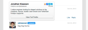
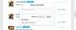

# Localizar cadenas{#localize-strings}

Personalización de las cadenas de las aplicaciones de Livefyre.

Las cadenas de texto para la mayoría de los elementos HTML de cualquier aplicación Livefyre se pueden personalizar. Esto proporciona la flexibilidad para cambiar el texto de los elementos HTML procesados, como el botón &quot;Publicar como&quot;, el texto &quot;Recuento de comentarios&quot; o el botón &quot;Iniciar sesión&quot;, a cualquier cadena UTF-8 válida. Utilice esta función para añadir personalidad a la implementación de la emisión o para localizar el idioma en la aplicación para la base de usuarios.

* Comentarios, chat y blog en directo

   * [Implementación](#c-localize-strings/section_im4_224_xz)
   * [Acceso a la cuenta](#c-localize-strings/section_cm3_d24_xz)
   * [Información de flujo](#c-localize-strings/section_wx1_c24_xz)
   * [Clasificación de flujo](#c-localize-strings/section_ih2_124_xz)
   * [Información de contenido](#c-localize-strings/section_llv_yd4_xz)
   * [Contenido destacado](#c-localize-strings/section_gmw_vd4_xz)
   * [Editor de texto](#c-localize-strings/section_ky5_td4_xz)
   * [Opciones de respuesta](#c-localize-strings/section_zvt_qd4_xz)
   * [Notificador de comentarios](#c-localize-strings/section_qqt_pd4_xz)
   * [Mensajes de error](#c-localize-strings/section_omz_jxn_xz)

* [Formato de fecha y hora](#c-localize-strings/section_yz4_g5n_xz)
* [Muro de los medios](#c-localize-strings/section_vwt_d5n_xz)
* [Mapa](#c-localize-strings/section_fxv_c5n_xz)
* [Mosaic](#c-localize-strings/section_e2s_b5n_xz)
* [Carrusel](#c-localize-strings/section_l2z_hkn_xz)
* [Tarjeta de características](#c-localize-strings/section_mw2_hkn_xz)
* [Encuesta](#c-localize-strings/section_pdg_fwh_xz)
* [Identidad de Livefyre](#c-localize-strings/section_zc3_xvh_xz)
* Más:
   * [Revisar cadenas de texto](/help/using/c-settings-other/c-translation-sets/c-review-text-strings.md#c_review_text_strings)
   * [Notas](/help/using/c-settings-other/c-translation-sets/c-sidenotes-text-strings.md#c_sidenotes_text_strings)

## Implementación {#section_im4_224_xz}

Para implementar esta función, pase una asignación de objeto 1-1 de las cadenas que desee reemplazar al objeto de configuración de JavaScript. Si no proporciona un campo, se utilizará el texto predeterminado.

Ejemplo:

```
var customStrings = {     
   postAsButton: "New Post As Text",     
   postEditButton: "New Post Edit Text"  
};   
   convConfig["strings"] = customStrings; fyre.conv.load(     
   networkConfig,     
   [convConfig],     
   function(){}  
);
```

Esta página enumera todas las cadenas de texto que pueden personalizarse para las aplicaciones principales de Livefyre.

## Acceso a la cuenta {#section_cm3_d24_xz}

Cadenas disponibles para el proceso de autenticación y en los menús de usuario autenticados.


| Elemento | Clave | Texto predeterminado |
|---|---|---|
|  | displayName | %s |
|  | editProfile | Editar perfil |
|  | notificationSettings | Configuración de notificaciones |
|  | siteAdmin | Admin Console (vínculos a Studio) |
|  | signOut | Cerrar sesión |

## Información de emisión {#section_wx1_c24_xz}

Cadenas disponibles para la visualización e información del flujo de contenido. Enumera el número de personas que escuchan, el número de publicaciones realizadas en la aplicación y permite a los usuarios iniciar sesión o acceder a la información de su cuenta.

| Clave | Texto predeterminado | Datos de flujo |
|---|---|---|
|  | commentCountLabelZero | comentario %s |
|  | commentCountLabel | comentario %s |
|  | commentCountLabelPlural | %s comentarios |
|  | listenerCount | escucha de persona |
|  | listenerCountPlural | personas escuchando |
|  | liveblogPostCountLabelZero | anuncio |
|  | liveblogPostCountLabel | anuncio |
|  | liveblogPostCountLabelPlural | publicaciones |
| Opciones de subproceso | threadBreakoutButton | Mostrar todo el subproceso |
|  | alternarContraer | Alternar Contraer |
| Comentarios de alta velocidad/en cola | actualizar | Actualizar |
|  | newComment | Nuevo comentario |
|  | newComments | Nuevos comentarios |
|  | newReply | nueva respuesta |
|  | newReanswers | nuevas respuestas |

## Clasificación de flujo {#section_ih2_124_xz}

Permite a los usuarios ordenar el contenido devuelto por edad o popularidad.


| Clave | Texto predeterminado | Opciones de encabezado |
|---|---|---|
|  | sortNewest | Más nuevo |
|  | sortOldest | Más antiguo |
|  | sortTopComments | Comentarios principales |
|  | sortHotThreads | Subprocesos en caliente |
|  | sortSeparator |  |  |
|  | streamSorting | Cargando |
|  | topCommentsContentNotFoundMsg | Todavía no hay suficientes &quot;me gusta&quot;. |
|  | hotThreadsContentNotFoundMsg | Todavía no hay suficientes subprocesos. |
|  | streamRefreshMsg | Vea las novedades. |
| Opciones de pie de página | archiveHeaderTitle | Desde el archivo |
|  | archiveShowMore | Mostrar más |
|  | showMore | Mostrar más comentarios |
|  | showMoreLiveblog | Mostrar más publicaciones |


## Información de contenido {#section_llv_yd4_xz}

Muestra información de anuncios: nombre de usuario, cualquier etiqueta de usuario aplicada y hora de publicación.

  

| Clave | Texto predeterminado | Autor |
|---|---|---|
|  | moderador | moderador |
|  | hovercardViewProfile | Ver perfil completo |
| Información del anuncio | timeJustNow | ahora |
|  | timeMinutesAgo | Hace minuto |
|  | timeMinutesAgoPlural | minutos atrás |
|  | timeHoursAgo | hour ago |
|  | timeHoursAgoPlural | horas atrás |
|  | timeDaysAgo | día anterior |
|  | timeDaysAgoPlural | días atrás |
|  | likePlural | Cantidad de &quot;Me gusta&quot; |
|  | likeSingular | Me gusta |
|  | moderatorEditTimestamp | Editado por un moderador |
|  | commentTombstone | Este comentario se ha eliminado |
|  | permalinkNotFoundMsg | Este comentario ya no es visible. |
|  | quickProfileTooltip | Perfil rápido |

## Contenido destacado {#section_gmw_vd4_xz}

Si está habilitado, el contenido destacado se muestra en la parte superior del flujo.

|  | Clave | Texto predeterminado |
|---|---|---|
| Etiquetas destacadas |  |  |
|  | featuredCommentsTag | Destacado |
|  | featuredCommentsTitlePlural | Comentarios destacados |

## Editor de texto {#section_ky5_td4_xz}

De forma predeterminada, está disponible en la parte superior de la página para todos los usuarios.


|  | Clave | Texto predeterminado |
|---|---|---| 
| Botones Editor | seguir | + Seguir |
|  | dejar de seguir | - Dejar de seguir |
|  | liveblogFollow | Seguir blog en directo |
|  | liveblogUnseguir | Dejar de seguir un blog en directo |
|  | postButton(disponible para usuarios que iniciaron sesión). | Comentario del anuncio |
|  | postAsButton(disponible para usuarios no autenticados). | Publicar comentario como... |
|  | postEditButton | Editar comentario |
|  | postEditAsButton | Editar comentario como... |
|  | postEditCancelButton | Cancelar |
|  | editorDisabled | Esta conversación está actualmente cerrada a nuevos comentarios. |
| Opciones de chat | livechatPostButtonLabel | Anuncio |
|  | livechatPostEditButton | Editar  |
|  | livechatWindowsInstruction | Pulse control+Intro para anunciar |
|  | livechatOtherInstruction | Pulse el comando+intro para publicar |

## Opciones de respuesta {#section_zvt_qd4_xz}

A menos que se indique lo contrario, esta opción estará disponible para todos los usuarios que hayan iniciado sesión. Pase el ratón sobre un panel de contenido para acceder.


| Clave | Texto predeterminado |  |
|---|---|---|
| Opciones de respuesta del usuario | Disponible para usuarios finales. |  |
| flagButton | Marcar |
|  | flagCommentTooltip | Marcar |
|  | editButton(Disponible solo para autores y moderadores, si está activado). | Editar  |
|  | deleteButton(Disponible solo para autores y moderadores, si está activado). | Eliminar |
|  | deleteCommentTooltip | Eliminar |
|  | shareButton | Compartir |
|  | shareCommentTooltip | Compartir |
|  | likeButton | Me gusta |
|  | differentButton | No me gusta |
|  | replyButton | Responder |
|  | replyButtonSingular (disponible para chat y blog en directo). | Responder |
|  | replyButtonPlural(disponible para chat y blog en directo). | Respuestas |


| Clave | Texto predeterminado |  |
|---|---|---|
| Marcar modo | flagTitle | Marcar comentario de %s |
|  | flagSubtitle | Marcar como |
|  | flagDefaultSelectOption | Seleccionar |
|  | flagSpam | Correo no deseado |
|  | flagSpamButton | Correo no deseado |
|  | flagSpamCommentTooltip | Correo no deseado |
|  | flagOffensive | Ofensivo |
|  | flagOffensiveButton | Ofensivo |
|  | flagOffensiveCommentTooltip | Ofensivo |
|  | flagDisaccept | Desacuerdo |
|  | flagDisacceptButton | Desacuerdo |
|  | flagDisacceptCommentTooltip | Desacuerdo |
|  | flagOffTopic | Desactivar tema |
|  | flagOfftopicButton | Desactivar tema |
|  | flagOfftopicCommentTooltip | Desactivar tema |
|  | flagEmail | Correo electrónico |
|  | flagEmailPlaceholder | you@example.com |
|  | flagNotes | Notas |
|  | flagNotesPlaceholder | Empieza a escribir aquí... |
|  | flagConfirmButton | OK |
|  | flagCancelButton | Cancelar |
|  | flagConfirmationMessage | ¿Marcar el comentario de %s como %s? |
|  | flagSuccessMsg | El comentario se ha marcado. |


| Clave | Texto predeterminado |  |
|---|---|---|
| Compartir modo | shareTitle | Compartir comentario |
|  | sharePlaceholderText | ¿Qué piensas? |
|  | shareLabel | Compartir en: |
|  | shareTextTwitter | en blanco |
|  | shareTextFacebook | en blanco |
|  | shareTextLinkedin | en blanco |
|  | shareButtonText | Compartir |
|  | sharePermalink | Permalink |
|  | loadingPermalink | Cargando url corta... |
|  | shareText | Acabo de publicar un comentario. ¡Echa un vistazo! |



| Clave | Texto predeterminado |  |
|---|---|---|
| Modal de respuesta | postReplyAsButton | Publicar comentario como... |
|  | postReplyButton(disponible para usuarios que iniciaron sesión). | Comentario del anuncio |
|  | backToHotThreads | Volver a subprocesos activos |


| Clave | Texto predeterminado |  |
|---|---|---|
| Modo @mention | mentionTitle | Compartir mención |
|  | mentionSubtitleTwitter | Compartir tweet con: |
|  | mentionDefaultText | ¡Te mencioné en un comentario de Livefyre! |
|  | mentionConfirmButton | OK |
|  | mentionCancelButton | Cancelar |
|  | mentionErrorGeneral | ¡Vaya! ¡Algo salió mal! Livefyre ha sido alertado. |
|  | mentionErrorNoneSelected | Debe tener al menos una mención activada. |
|  | mentionMenuTitle | Para ver y mencionar a tus amigos |
|  | mentionTwitterConnect | Conectarse a Twitter |
|  | mentionTwitterFetching | Buscando amigos... |
|  | mentionSuccessMsg | Las menciones se han enviado correctamente. |


| Clave | Texto predeterminado |  |
|---|---|---|
| Editar modo | Disponible para administradores de Studio, administradores de usuarios o moderadores |  |
| @(@mention). | &lt;/>(Abre la ventana HTML personalizada). |  |
|  | customHtmlDialogTitle(Aparece como encabezado del modal). | Agregar HTML personalizado |


| Clave | Texto predeterminado |  |
|---|---|---|
| Opciones de respuesta del moderador | Disponible para administradores de Studio, administradores de usuarios o moderadores. |  |
| pendingComment | pending |
|  | banUserButton | Prohibir usuario |
|  | banUserTooltip | Prohibir usuario |
|  | bozoButton | Bozo |
|  | bozoCommentTooltip | Bozo |
|  | featureButton | Función |
|  | featureCommentTooltip | Función |
|  | unfeatureButton | Desfunción |
|  | featuredCommentTooltip | Desfunción |


| Clave | Texto predeterminado |  |
|---|---|---|
| Prohibir modo de usuario | Disponible para administradores de Studio, administradores de usuarios o moderadores. |  |
| banTitle | Prohibir usuario |  |
|  | banConfirmation | ¿Está seguro de que desea prohibir este usuario? |
|  | banConfirmButton | OK |
|  | banCancelButton | Cancelar |

## Notificador de comentarios {#section_qqt_pd4_xz}

Si está habilitado, disponible en la parte inferior de la página para todas las aplicaciones de conversación de Livefyre.


|  | Clave | Texto predeterminado |
|---|---|---|
| Etiquetas de notificador | commentNotifier | Nuevo comentario |
|  | commentNotifierPlural | Nuevos comentarios |
|  | liveblogNotifier | Nueva publicación |
|  | liveblogNotifierPlural | Nuevos anuncios |

## Mensajes de error {#section_omz_jxn_xz}

Cadenas disponibles para mensajes de error personalizables.

| Clave | Texto predeterminado |
|---|---|
| errorAuthError | No está autorizado a publicar un comentario en esta conversación |
| errorCommentsNotAllowed | No se permiten comentarios en esta conversación |
| errorDefault | Se ha producido un error. Inténtelo de nuevo. |
| errorDuplicate | Por más que le guste su comentario, no se le permite publicarlo dos veces. |
| errorEditDuplicate | Debe cambiar el cuerpo del comentario cuando lo edite. |
| errorEditNotAllowed | No se le permite editar comentarios en esta conversación. |
| errorEditTimeExceeded | Lo sentimos, el período de edición de comentarios ha caducado. |
| errorEmpty | Parece que está intentando publicar un comentario vacío. |
| errorExpired | Su sesión ha caducado. Vuelva a cargar la página. |
| errorFlagNotSelected | Seleccione un tipo de indicador. |
| errorGuestLiked | Lo sentimos, solo a aquellos con cuentas les puede gustar el contenido. |
| errorInsuficientePermissions | Permisos insuficientes |
| errorInvalidChar | Parece que está intentando publicar un carácter no válido. |
| errorLikeOwnComment | No le gusta su propio comentario |
| errorMalform | Parece que está intentando publicar contenido con formato incorrecto. |
| errorMaxChars | Lo siento, tu comentario es demasiado largo. Edite e inténtelo de nuevo. |
| errorMediaNotAvailable | El contenido ya no es visible. |
| errorShowMore | Error al cargar más comentarios. |
| MultipleMediaNotAllowedError | Los permisos solo le otorgan un adjunto de medios a la vez. |

## Formato de fecha y hora {#section_yz4_g5n_xz}

Traduzca y personalice cómo aparecen las fechas en las tarjetas de contenido dentro de las aplicaciones de visualización.

| Clave | Texto predeterminado |
|---|---|
| hoursAgo | {número}h |
| hoursAgoSingular | {número}h |
| justNow | 1s |
| minutesAgo | {número}m |
| minutesAgoSingular | {número}m |
| monthDayFormat | {day} {monthAbbrev} |
| monthDayYearFormat | {day} {monthAbbrev} {year} |
| monthNames | Enero, febrero, marzo, abril, mayo, junio, julio, agosto, septiembre, octubre, noviembre, diciembre |
| monthNamesAbbrev | Ene, Feb, Mar, Abr, Mayo, Jun, Julio, Ago, Septiembre, Oct, Nov, Dic. |
| secondsAgo | {número}s |
| secondsAgoSingular | {número}s |

## Muro de medios {#section_vwt_d5n_xz}

Cadenas disponibles para la aplicación de muro de medios.

| Clave | Texto predeterminado |
|---|---|
| featuredText | Destacado |
| shareButtonText | Compartir |

| Clave | Texto predeterminado |
|---|---|
| postButtonText | ¿Qué tienes en mente? |
| postModalTitle | Publicar el comentario |
| postModalButton | Publicar el comentario |
| postModalPlaceholder | ¿Qué te gustaría decir? |
| showMoreButtonText | Cargar más |
| shareButtonText | Compartir |

## Mapa {#section_fxv_c5n_xz}

Cadenas disponibles para Mapas.

| Clave | Texto predeterminado |
|---|---|
| featuredText | Destacado |
| shareButtonText | Compartir |

## Mosaic {#section_e2s_b5n_xz}

Cadenas disponibles para Mosaics.

| Clave | Texto predeterminado |
|---|---|
| featuredText | Destacado |
| shareButtonText | Compartir |

## Carrusel {#section_l2z_hkn_xz}

Cadenas disponibles para Carrusel.

| Clave | Texto predeterminado |
|---|---|
| featuredText | Destacado |
| shareButtonText | Compartir |

## Tarjeta de características {#section_mw2_hkn_xz}

Cadenas disponibles para la tarjeta de características.

| Clave | Texto predeterminado |
|---|---|
| featuredText | Destacado |
| shareButtonText | Compartir |

## Cargar aplicación {#section_grc_gkn_xz}

Cadenas disponibles para la aplicación de carga.

| Clave | Texto predeterminado |
|---|---|
| postButtonText | ¿Qué tienes en mente? |
| postModalTitle | Publicar el comentario |
| postModalButton | Publicar el comentario |
| postModalTitlePlaceholder | Escribir un título |
| postModalPlaceholder | ¿Qué te gustaría decir? |
| postModalConfirationTitle | ¡Gracias por publicar! |
| postModalConfirmationMessage | Su publicación está siendo revisada. |
| postModalConfirmationButton | Finalizado |
| title |  |
| message |  |
| editorErrorAttachmentsRequired | Se requiere un adjunto |
| editorErrorBody | Añada un mensaje |
| editorErrorDuplicate | Por más que te guste tu nota, no puedes publicarla dos veces |
| editorErrorGeneric | Ha ocurrido un error |
| editorErrorTitleRequired | Se requiere un título |

## Encuesta {#section_pdg_fwh_xz}

Cadenas disponibles para Encuestas.

| Clave | Texto predeterminado |
|---|---|
| totalVotesLabel | %s votos totales |
| shareStringText | Acabo de votar en %s ¿cuál es tu voto? |
| pollClosedLabel | Esta encuesta está actualmente cerrada |

## Identidad de Livefyre {#section_zc3_xvh_xz}

Cadenas disponibles para la identidad de Livefyre.

| Clave | Texto predeterminado |
|--- |--- |
| automaticallyFollowConversations | Seguir automáticamente las conversaciones a las que me uno |
| back | Atrás |
| bio | Biografía |
| crear | Crear  |
| createANewAccount | Crear nueva cuenta |
| createNewAccountWithEmail | Crear una nueva cuenta con un correo electrónico |
| changeAvatar | Cambiar avatar |
| choiceFile | Elegir archivo |
| completeAccount | Cuenta completa |
| emailWhenAlguienReply | Enviar correo electrónico cuando alguien me responda |
| emailCommentsIFollow | Comentarios por correo electrónico en conversaciones que sigo |
| emailSenttoResetPassword | Correo electrónico enviado Busque en la bandeja de entrada un vínculo para restablecer la contraseña |
| emailVerifySent | Verificación de correo electrónico enviada |
| firstName | Nombre |
| completedPassword | ¿Olvidó la contraseña? |
| olvidóYourPassword | ¿Olvidó su contraseña? |
| OlvidóYourPasswordInstructions | Introduzca su nombre de usuario o dirección de correo electrónico a continuación y le enviaremos un enlace para cambiar su contraseña. |
| formInputCloseButtonText | Cierre |
| formInputCancelButtonText | Cancelar |
| formInputSaveButtonText | Guardar |
| hasNotLeftAnyComments | no ha dejado comentarios |
| locationIsFrom | es de |
| labelAvatar | Avatar |
| labelComments | Comentarios |
| labelConfirmNewPassword | Confirmar nueva contraseña |
| labelConfirmPassword | Confirmar contraseña |
| labelEmail | Email Address |
| labelLike | Cantidad de &quot;Me gusta&quot; |
| labelLoading | Cargando |
| labelNewPassword | Nueva contraseña |
| labelNotification | Notificaciones |
| labelPassword | Contraseña |
| labelProfile | Perfil |
| labelUsername | Nombre de usuario |
| labelUsernameOrEmail | Nombre de usuario o correo electrónico |
| lastName | Apellido |
| livefyreAccount | Cuenta de Livefyre |
| ubicación | Ubicación |
| loadingProfile | Cargando perfil |
| newPassword | Nueva contraseña |
| oldPassword | Contraseña antigua |
| on | en |
| o | o |
| passwordLinkExpired | El vínculo en el que hizo clic para restablecer la contraseña ha caducado. Vuelva a restablecer la contraseña y le enviaremos un nuevo vínculo. |
| pleasecheckEmailToComplete | Compruebe su correo electrónico para completar su registro. |
| publicado | Publicado |
| powerBy | equipado con |
| profileNotificationInmediate | immediate |
| profileNotificationHourly | por hora |
| profileNotificationNever | never |
| recentComments | Comentarios recientes |
| restablecer | Reset |
| resetPassword | Restablecer contraseña |
| signIn | Iniciar sesión |
| signInWith | Iniciar sesión con |
| signInWithEmail | Iniciar sesión con correo electrónico |
| signUp | Registrarse |
| socialAccount | Cuenta social |
| successPasswordChanged | Correcto! La contraseña se ha cambiado y ya ha iniciado sesión |
| termsAndConditions | Términos y condiciones |
| termsAndConditionsIntro | Al registrarse, acepta la variable |
| termsOfUse | Condiciones de uso |
| termsOfUseIntro | Al iniciar sesión, acepta |
| thisUser | Este usuario |
| verifyPassword | Comprobar contraseña |
| fileSizeLimit | Máximo de 2 MB |
| accountnotfound | No se encontró la cuenta |
| avatarImageExceedSize | Su imagen de avatar ha superado el límite de archivos de 2 mb |
| campo disrequerido | El campo solo acepta un número entero |
| fieldonlyaceptsavalidemail | El campo solo acepta un correo electrónico válido |
| fieldonlyacepts | El campo solo acepta letras |
| filesizemustbelessthanMB | El tamaño del archivo debe ser menor que {#}MB |
| invalidusernameorpassword | Nombre de usuario o contraseña no válidos |
| minimumlongthofcharacter | Longitud mínima de {#} caracteres |
| maximumlongthofcharacter | Longitud máxima de {#} caracteres |
| therewasanerror | Ha ocurrido un error |
| este campo no es necesario | Este campo es obligatorio. |
| validfileextensions | Extensiones de archivo válidas |
| valuemustmatch | El valor debe coincidir |
| passwordLength | de 6 a 32 caracteres de longitud. |
| passwordCharacters | incluye caracteres en mayúsculas y minúsculas. |
| passwordSymbols | incluir al menos un número y un símbolo. |
| passwordUsername | no contenga su nombre de usuario. |
| passwordPopoverTitle | La contraseña debe: |
| passwordErrorContainsFirstName | La contraseña que ha introducido contiene el nombre de usuario, el nombre o los apellidos. Por motivos de seguridad, introduzca una contraseña que no contenga su nombre de usuario, nombre o apellido. Recuerde también que su contraseña debe contener: 6 a 32 caracteres Carácter en mayúsculas Carácter en minúsculas Símbolo A |
| passwordErrorContainsLastName | La contraseña que ha introducido contiene el nombre de usuario, el nombre o los apellidos. Por motivos de seguridad, introduzca una contraseña que no contenga su nombre de usuario, nombre o apellido. Recuerde también que su contraseña debe contener: 6 a 32 caracteres Carácter en mayúsculas Carácter en minúsculas Símbolo A |
| passwordErrorContainsUsername | La contraseña que ha introducido contiene el nombre de usuario, el nombre o los apellidos. Por motivos de seguridad, introduzca una contraseña que no contenga su nombre de usuario, nombre o apellido. Recuerde también que su contraseña debe contener: 6 a 32 caracteres Carácter en mayúsculas Carácter en minúsculas Símbolo A |
| passwordErrorTooShort | Mínimo de 6 caracteres para la contraseña |
| passwordErrorTooLong | Máximo de 32 caracteres para la contraseña |
| passwordErrorMissingUppercase | La contraseña debe contener al menos un carácter en mayúsculas |
| passwordErrorMissingLowercase | La contraseña debe contener al menos un carácter en minúscula |
| passwordErrorMissingSymbol | La contraseña debe contener al menos un símbolo en el conjunto `!@#$%^&*()?.,<>\’;:”[]{}|` |
