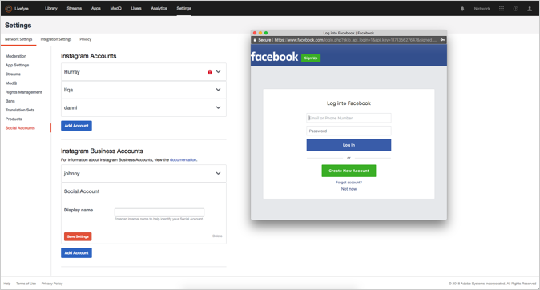

# Agregar una cuenta social{#add-a-social-account}

Configure una cuenta social para solicitar derechos o buscar UGC en flujos o búsquedas sociales.

Livefyre usa cuentas sociales de Twitter e Instagram para permitirle realizar una búsqueda social (en la biblioteca) o utilizar flujos.

Debe configurar una cuenta en Twitter para utilizar la búsqueda social de Twitter en la biblioteca.

Instagram tiene reglas diferentes para las cuentas sociales, dependiendo de cómo utilice Adobe Livefyre. Para obtener información sobre el tipo de cuentas sociales que puede utilizar con Livefyre, consulte [Acerca de las cuentas de Instagram](/help/using/c-users-creating-accounts-with-studio-access/t-configure-social-accout-instagram/c-about-instagram-accounts.md#c_about_instagram_accounts).

Para configurar una cuenta social:

1. Navegue hasta **[!UICONTROL Settings >]****[!UICONTROL Network Settings.]**
1. Vaya a **[!UICONTROL Social Accounts]** la sección debajo **[!UICONTROL Network Settings]**.
1. Haga clic **[!UICONTROL Add Account]** en el tipo de cuenta social que está agregando. Aparece un cuadro de diálogo que permite autorizar la cuenta de Livefyre.

   

   >[!NOTE]
   >
   >Cuando configura una cuenta empresarial de Instagram, se le dirigirá a una pantalla de inicio de sesión de Facebook. Continúe con el inicio de sesión como normal.  >

1. Haga clic para **[!UICONTROL Authorize App]** continuar.
1. Agregue un **[!UICONTROL Display Name]** para la cuenta y haga clic **[!UICONTROL Save Settings.]**en. Haga clic en **[!UICONTROL Social Account]** el encabezado del cuadro de información de la cuenta para contraer la cuenta.
